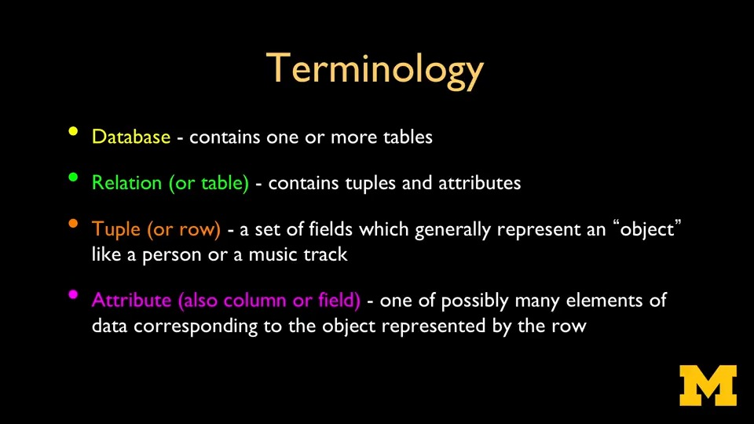
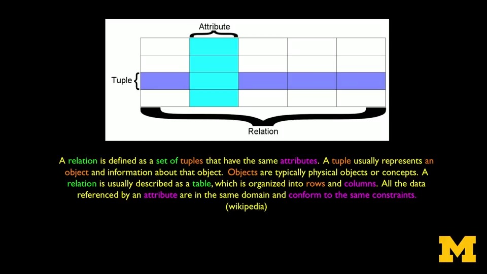
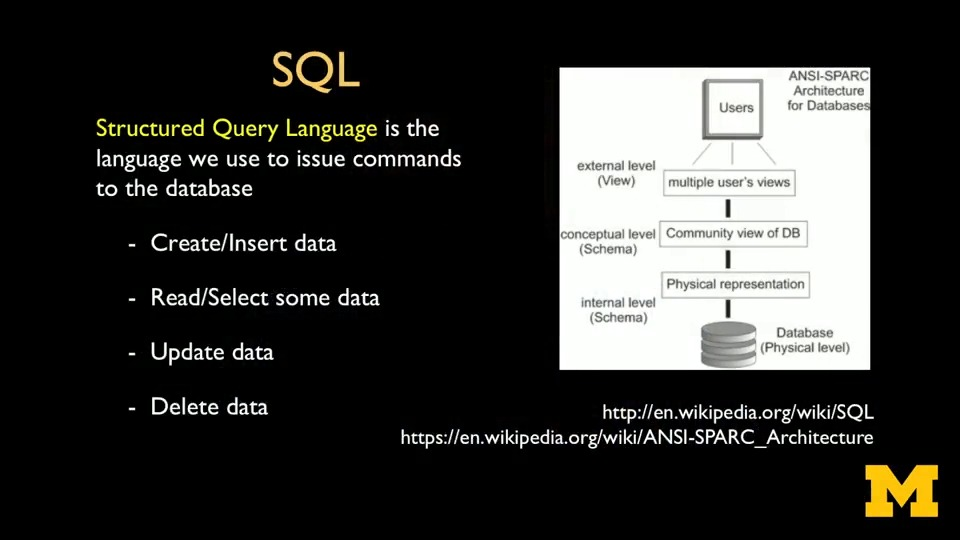
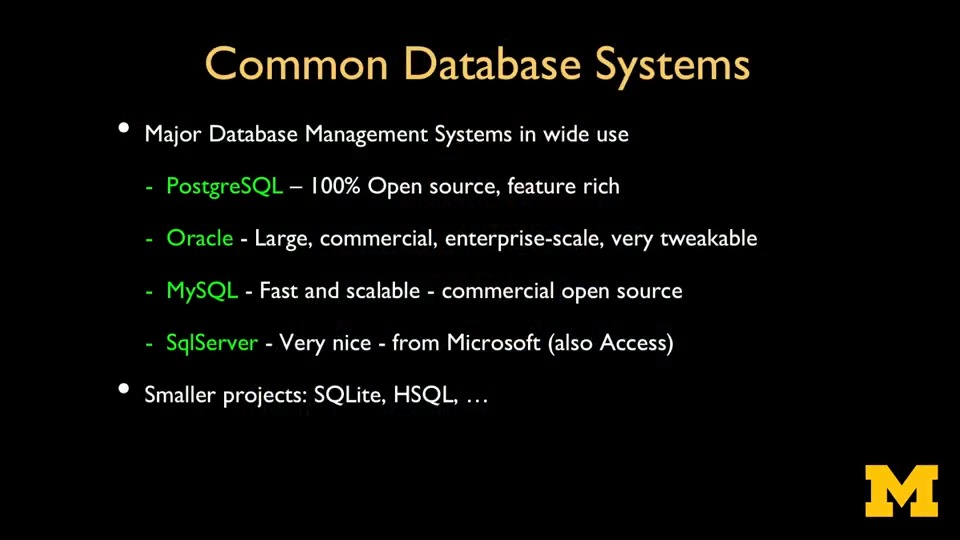
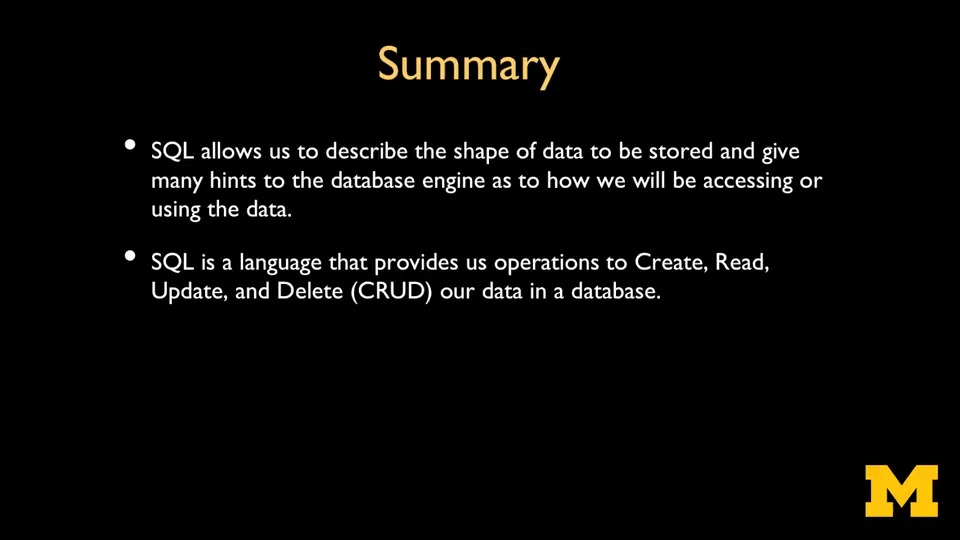

# Database Design and Basic SQL in PostgreSQL

The Database Design and Basic SQL in PostgreSQL course by UMich through Coursera

---

## Introduction to SQL Core

### SQL: Concepts

### SQL: Language

### SQL: Common Implementations

### SQL Core

#### Creation, Retrieval, Update and Deletion (CRUD)

[See Here](crud.md)

#### Data Types

[See Here](data-types.md)

#### Key and Index

[See Here](key-and-index.md)

### SQL: Summary

---

## 