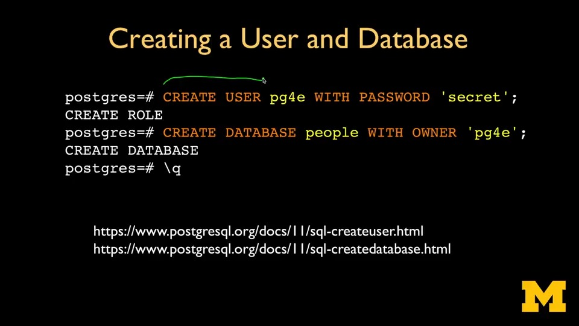
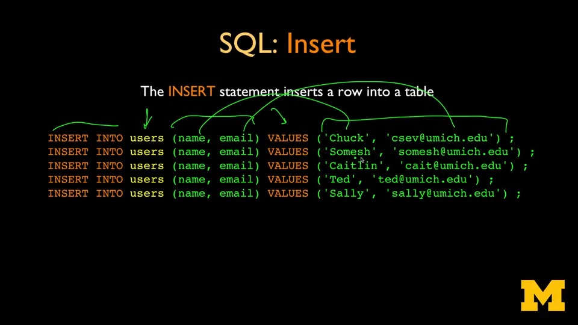
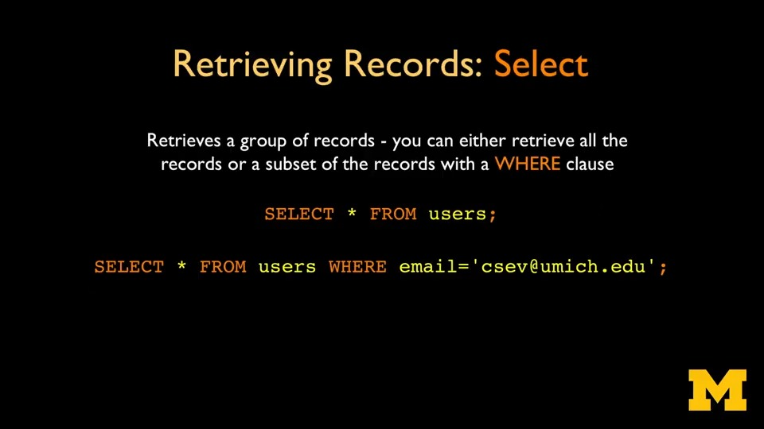
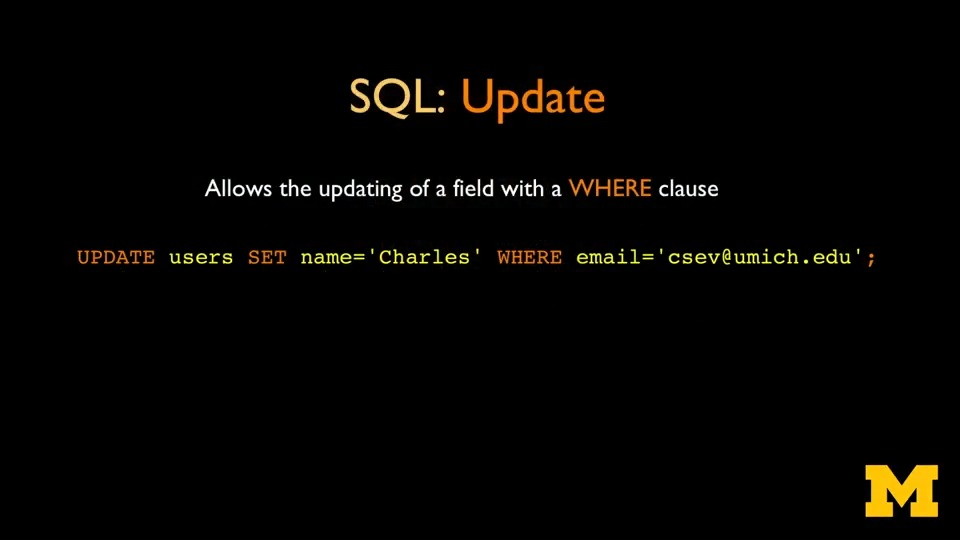
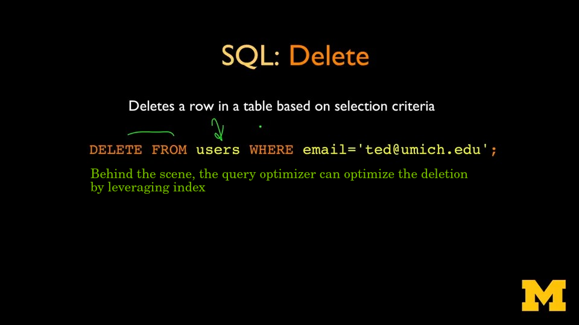
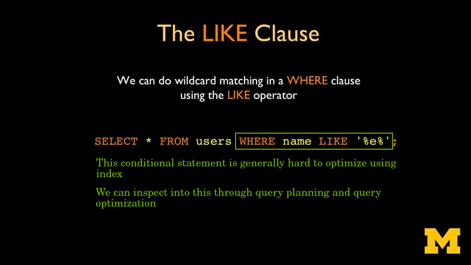
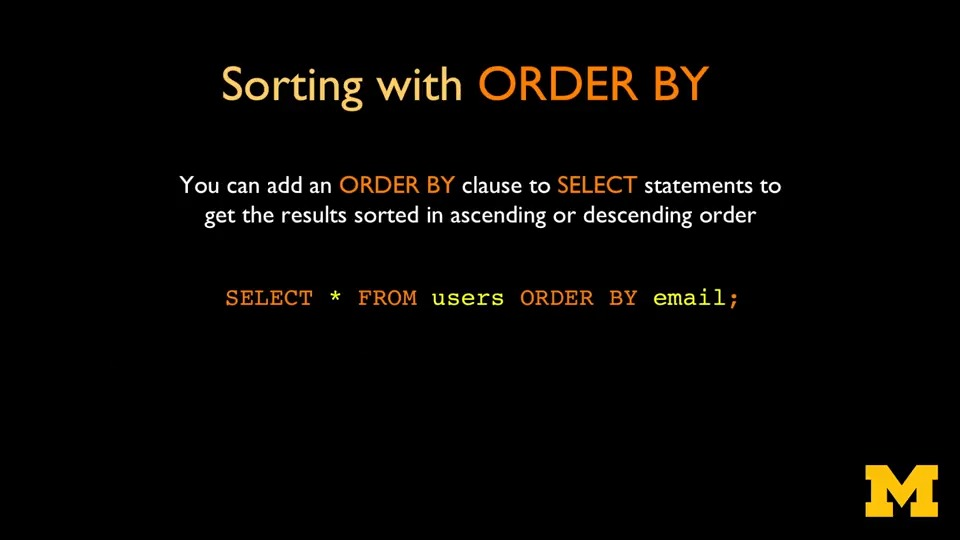
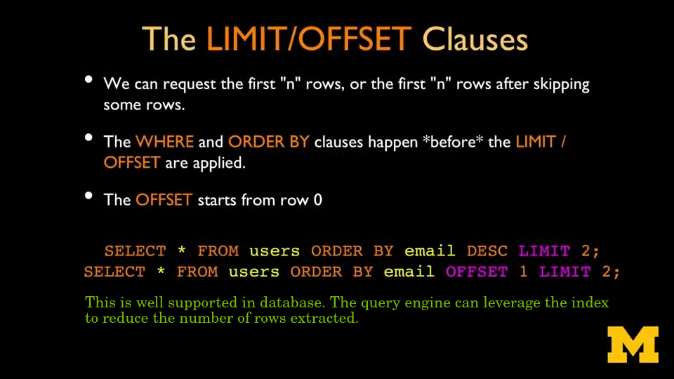
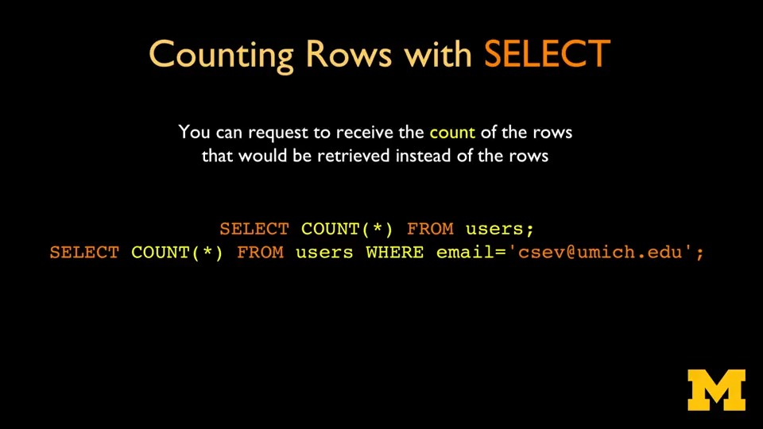
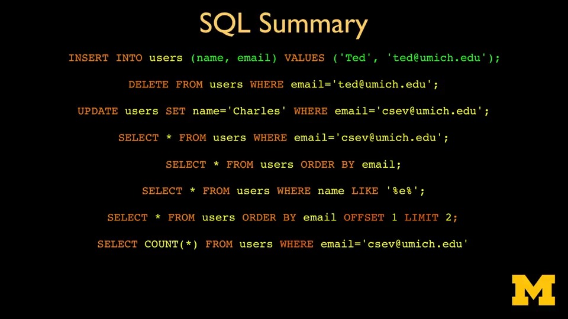

# Create, Read, Update and Delete

The Database Design and Basic SQL in PostgreSQL course by UMich through Coursera

---

## Connect to Database

```bash
docker run -it --rm postgres psql -h pg.pg4e.com -p 5432 -U pg4e_47e3719f9b pg4e_47e3719f9b
```

---

## Create User and Database



---

## CRUD

### Create Rows



---

### Retrieve Rows



---

### Update Rows



---

### Delete Rows



---

## Wildcard Matching



---

## Sorting



---

## Paging



---

## Counting



---

## Summary: SQL Core

