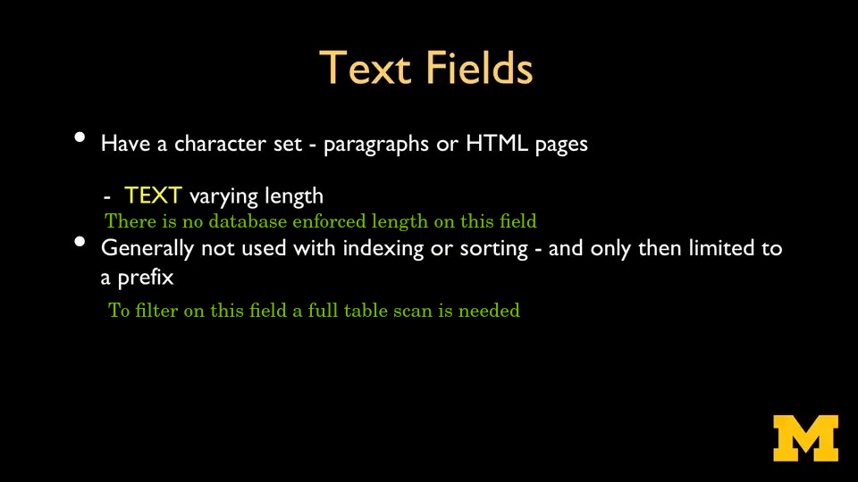

# Data Types


---

## Overview


---

## String and Text

Both string and text fields have an associated character set, which is represented as encoding.

### String Field

The string field has a database enforced max length associated with it


* CHAR(n) (fixed-length)  
  * **Typical Use** Holds data that is always the same length, like **ISO country codes (“US”, “GB”**) or other fixed-size codes/identifiers.  
  * **Reasoning** 
    * CHAR(n) pads values with **trailing spaces up to n to enforce a fixed length**.  
    * If you know the data is always exactly n characters, CHAR(n) can help maintain consistent formatting. However, many designers skip CHAR(n) even in these narrow cases, because **trailing spaces can cause confusion in comparisons**.  

* VARCHAR(n) (variable-length with max length)  
  * **Typical Use** Storing strings that **have a known, enforceable upper bound**. For example, a “first_name” or “email” field that should not exceed, say, 255 characters.  
  * **Reasoning**  
    * Provides a business-rule check at the database layer (the value must not exceed n characters).  
    * Many production systems use VARCHAR(n) to ensure input cannot exceed some known constraint (like a form field limit).  

### Text Field

The text field doesn't have a database enforced max length associated with it



* TEXT (unbounded)  
  * **Typical Use** Storing strings **of arbitrary size**, such as blog posts, product descriptions, or JSON strings that can vary widely.  
  * **Reasoning**  
    * TEXT does not enforce any maximum size, so your application can handle large text without external checks.  
    * For practical purposes, if you do not need or want a strict length rule, TEXT is straightforward.  

### Implications for Storage Efficiency & Performance

* CHAR(n)  
  * **Storage**  
    * PostgreSQL pads the stored value to length n with trailing spaces. This can lead to **wasted space** if your actual content is frequently shorter than n.  
  * **Retrieval**  
    * The trailing spaces can cause confusion if not carefully trimmed.  
    * Comparison semantics can behave differently (some comparisons strip trailing spaces, others do not, depending on context).  
  * **Efficiency**  
    * Because of the trailing padding, CHAR(n) can be **less efficient if your data is of varying length**.  

* VARCHAR(n)  
  * **Storage**
    * Variable length. PostgreSQL only stores the actual string plus an overhead for length tracking.  
    * The database rejects inserts/updates that exceed the n-character limit.  
  * **Retrieval**  
     * No trailing space issues. The stored value is exactly as input, up to n chars.  
  * **Efficiency**  
    * Internally, **VARCHAR(n) and TEXT have nearly identical performance characteristics for reads and writes when data is within the limit**.  
    * The advantage is you have a built-in constraint that prevents overly large inputs.

* TEXT  
  * **Storage**  
    * Variable length, without an upper bound. PostgreSQL handles large values with TOAST (The Oversized-Attribute Storage Technique), **storing the text data out-of-line** if it’s too large.  
  * **Retrieval**  
    * Reading large TEXT columns can be slightly more expensive if the data is stored out-of-line. But for smaller content, performance is effectively the same as VARCHAR.  
  * **Efficiency**  
    * If your application always deals with small to moderately sized strings, TEXT is just as efficient as VARCHAR(n), with no overhead for trailing spaces and no maximum-length constraint to manage.  
    * If the column occasionally holds very large text, performance can be impacted depending on how often that large text is read.  

* Summary
• **Internal Equivalence Between VARCHAR and TEXT** In PostgreSQL, VARCHAR(n) and TEXT are effectively stored similarly (both are variable-length types). The main difference is that VARCHAR(n) enforces a length constraint at insertion/update time, while TEXT does not.  
• **Data Integrity vs. Flexibility** If your domain requires a strict maximum length, use VARCHAR(n). If not, TEXT is simpler.  
• **CHAR(n) is Rare in Practice** Because of trailing-space padding and special comparison rules, **CHAR(n) is only recommended when you truly have fixed-size values (like two-letter state codes)**. Most teams default to VARCHAR(n) or TEXT.  
• **Performance** For small to medium strings, you typically see no appreciable performance difference among CHAR(n), VARCHAR(n), and TEXT. For large data, plan how frequently it is read or updated, as large TEXT columns might be moved out-of-line with TOAST.  

---

## Binary

PostgreSQL supports raw binary field as BYTEA.


### Definition

```pgsql
CREATE TABLE my_table (
    id SERIAL PRIMARY KEY,
    data BYTEA
);
```

### Manipulation

When inserting binary data, PostgreSQL expects **escape format** as follows

```pgsql
INSERT INTO my_table (data) VALUES (E'\xDEADBEEF');
```

### Use Cases

Binary field is usually used to store binary data such as

- **Binary Files/Blobs**, such as associated documents and images

- **Cryptographic Artifacts**, such as hashed password digests, or any cryptographic tokens

- **Protobuf or BSON Data**, for the management of binary-serialized objects

---

## Integer


---

## Floating-Point Number


---

## Datetime


