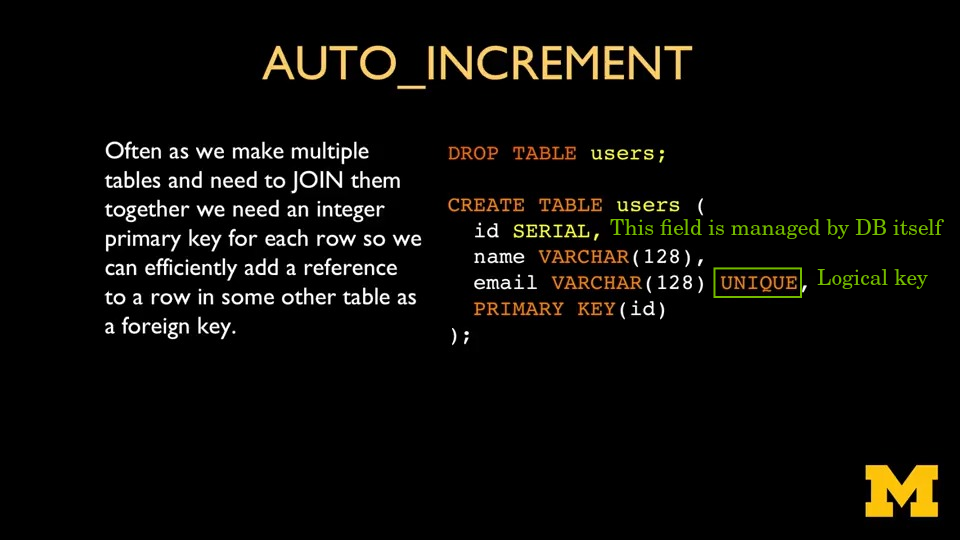
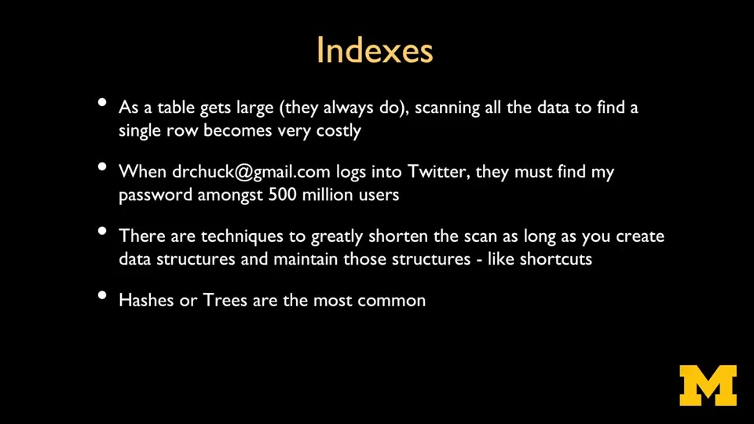
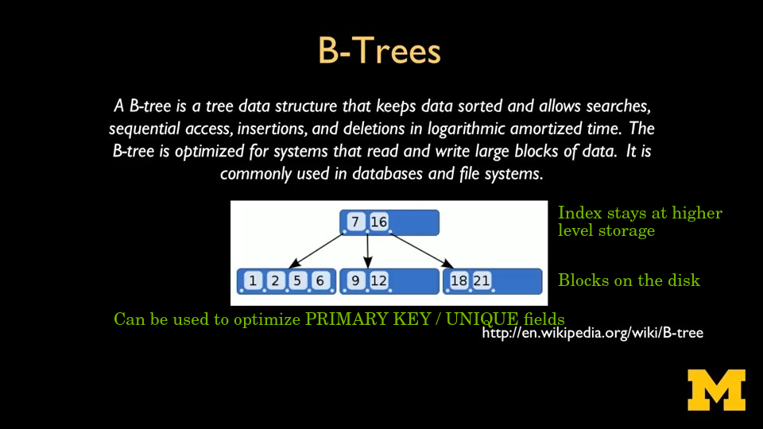
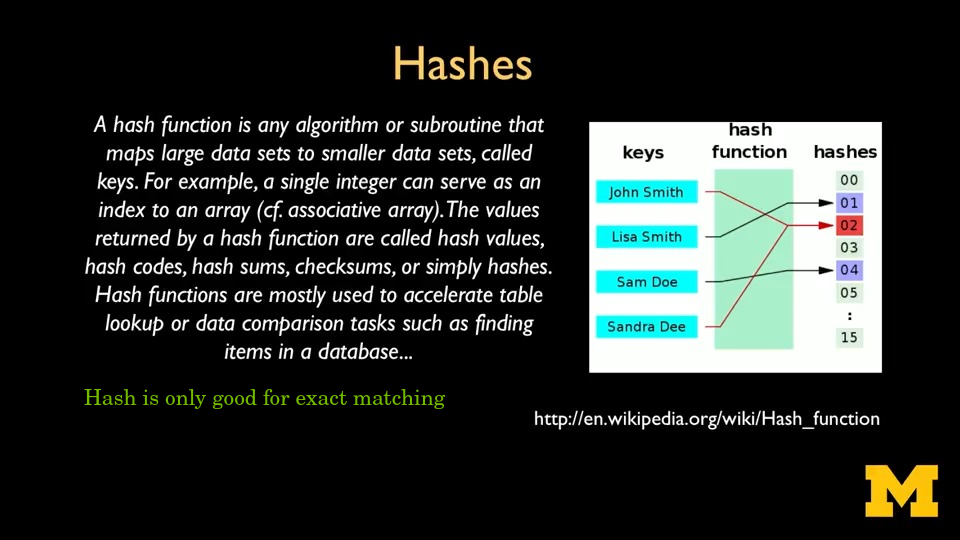

# Key and Index

The Database Design and Basic SQL in PostgreSQL course by UMich through Coursera

---

## Serial Field

---

## Index

### B-Tree

B-tree index can also be used to accelerate range search and prefix matching

### Hash

Hash index is only good for accelerating exact match

