# Introduction to Relational Database Design

A quick introduction to relational database design

---

## Introduction

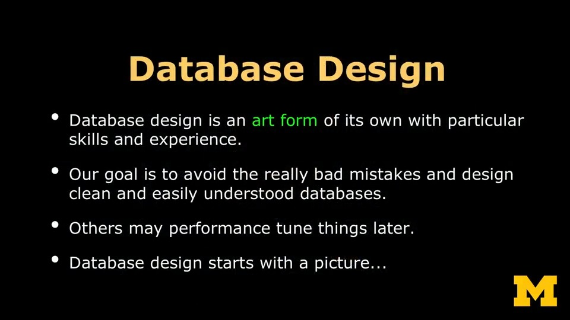

---

## Main Idea: Reducing Redundancy

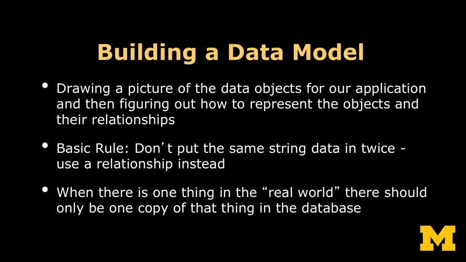

**Normalization** is the systematic process of organizing data in a database to reduce redundancy and improve data integrity.

Below is a short overview of normalization levels (1NF, 2NF, 3NF) with simple, concrete examples to illustrate why each step matters.

---

## Introduction to Key Design

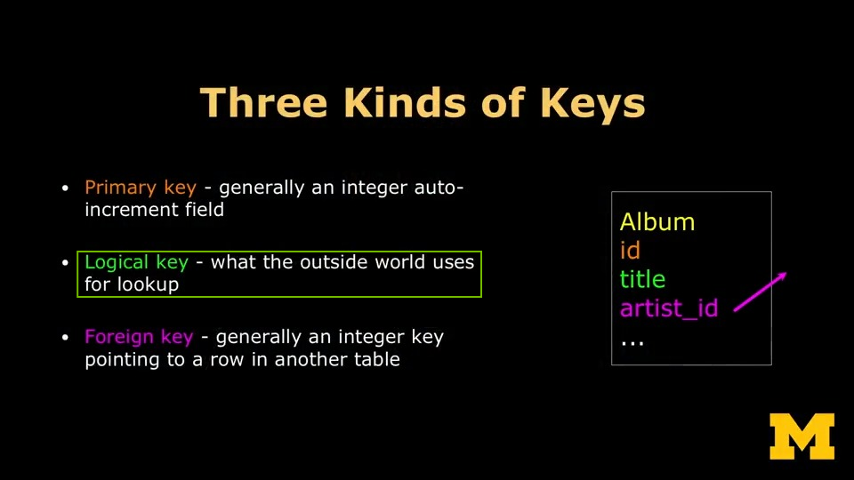

### Primary and Logical Keys

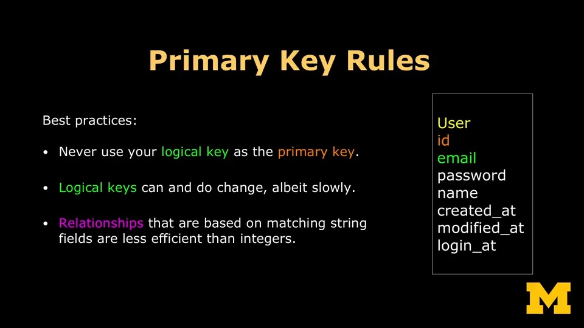

### Foreign Key

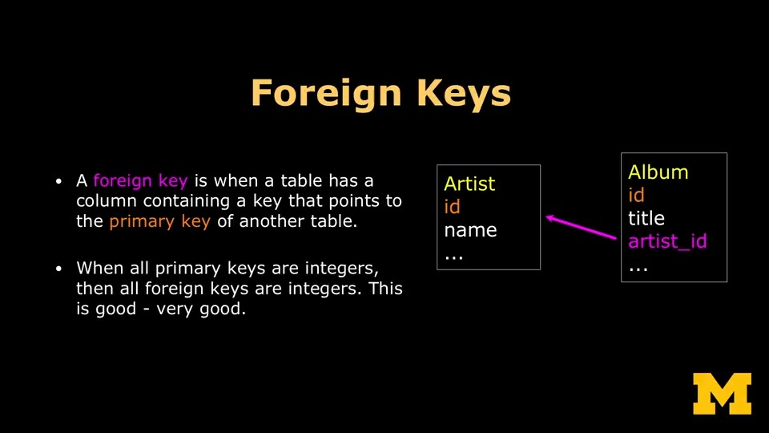

---

## Introduction to Normalization

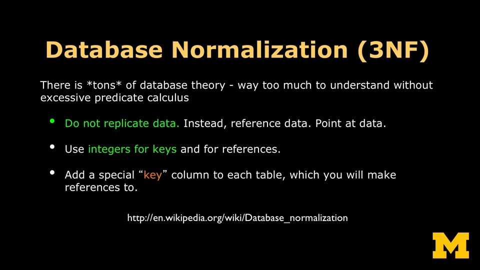

### Normalization Patterns

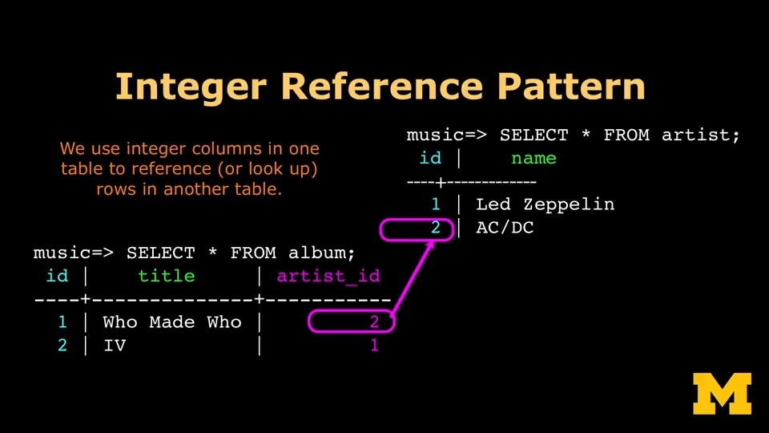

---

### First Normal Form (1NF)

Ensure **each row-column position has a single value (atomicity)**.

**Use Case** Model customers who could have multiple phone numbers such as "555-1111, 555-2222".

#### Before

This violates 1NF because the column phone_numbers holds more than one piece of information.

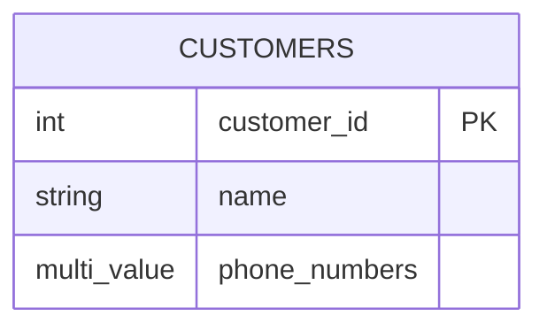
```mermaid
erDiagram
    %% 1NF Example - Before Normalization
    CUSTOMERS {
        int customer_id PK
        string name
        multi_value phone_numbers
    }
```

#### After

Now each row stores exactly one phone number with a link back to the customer_id.

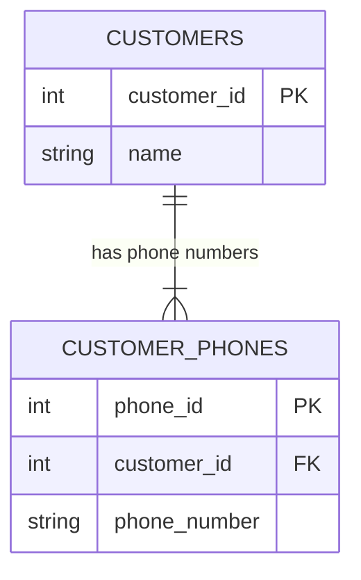
```mermaid
erDiagram
    %% 1NF Example - After Normalization
    CUSTOMERS {
        int customer_id PK
        string name
    }

    CUSTOMER_PHONES {
        int phone_id PK
        int customer_id FK
        string phone_number
    }

    CUSTOMERS ||--|{ CUSTOMER_PHONES : "has phone numbers"
```

---

### Second Normal Form (2NF)

Ensure that non-key attributes depend on the whole key, not just part of it (applies when the primary key is composite).

**Use Case** Model orders placed on the e-commerce site

#### Before

Here, product_description depends on product_id alone, not on (order_id, product_id). Storing product_description in Orders means it partially depends on just product_id.

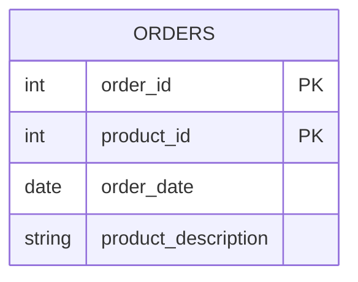
```mermaid
erDiagram
    %% 2NF Example - Before Normalization
    ORDERS {
        int order_id PK
        int product_id PK
        date order_date
        string product_description
    }
```
#### After

By splitting out product details into a separate products table, all attributes in orders now depend on the primary key. 

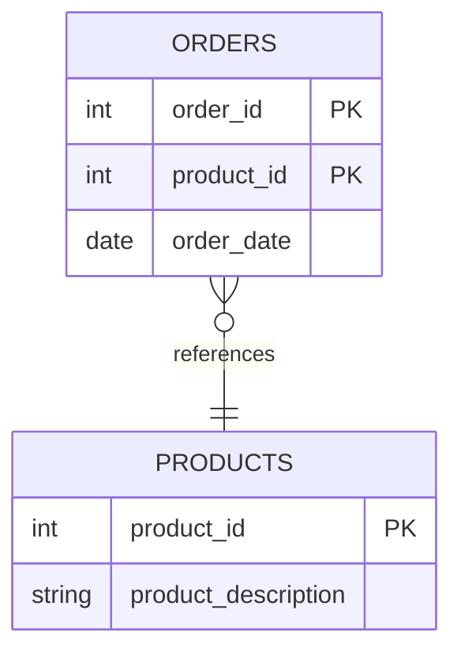
```mermaid
erDiagram
    %% 2NF Example - After Normalization
    ORDERS {
        int order_id PK
        int product_id PK
        date order_date
    }

    PRODUCTS {
        int product_id PK
        string product_description
    }

    ORDERS }o--|| PRODUCTS : "references"
```

---

### Third Normal Form (3NF)

Goal: Remove transitive dependencies so that non-key attributes depend directly on the primary key, rather than on other non-key attributes.

#### Before

Suppose department_name also determines department_location. Then department_location depends on department_name rather than directly on PK employee_id.

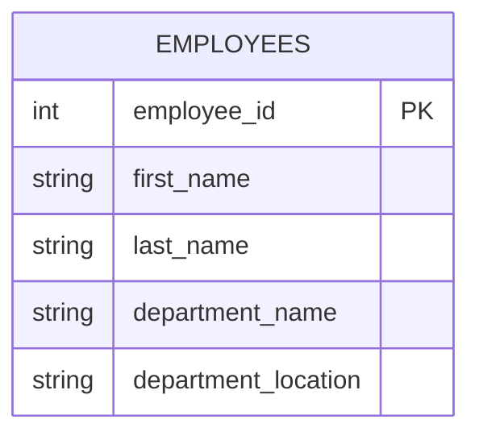
```mermaid
erDiagram
    %% 3NF Example - Before Normalization
    EMPLOYEES {
        int employee_id PK
        string first_name
        string last_name
        string department_name
        string department_location
    }
```

#### After

Now, department_location depends on department_id in the Departments table, which is determined by employee_id in Employees.
 
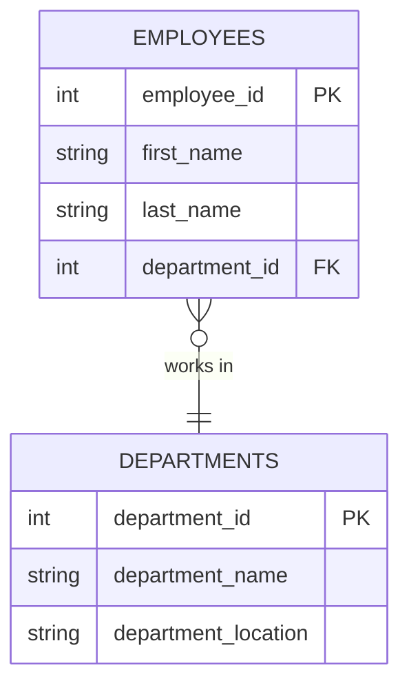
```mermaid
erDiagram
    %% 3NF Example - After Normalization
    EMPLOYEES {
        int employee_id PK
        string first_name
        string last_name
        int department_id FK
    }

    DEPARTMENTS {
        int department_id PK
        string department_name
        string department_location
    }

    EMPLOYEES }o--|| DEPARTMENTS : "works in"
```

---

### Boyce-Codd Normal Form (BCNF)

Boyce-Codd Normal Form (BCNF) is a stronger version of 3NF. In BCNF, for every functional dependency X → Y, X must be a candidate key. 

A typical violation arises when some non-key attribute(s) partially determine(s) another attribute, but that determining attribute isn’t part of a key itself.

---

### Summary

- Normalization reduces duplicate data, making it easier to manage updates, insertions, and deletions.  
- As you move from 1NF to 2NF and 3NF, you systematically remove different types of redundancies and anomalies.  
- In practical database design, many teams find 3NF sufficient. More advanced normal forms (like BCNF, 4NF) address more specialty issues but follow the same core principle: keep each piece of information stored in exactly one, logically consistent place.
- Sometimes normalizing too aggressively can sometimes affect query performance (e.g., too many joins). Balancing normalization and performance is a key design decision.

---

## Example: iTunes Play List Modeling

---

### E-R Digram

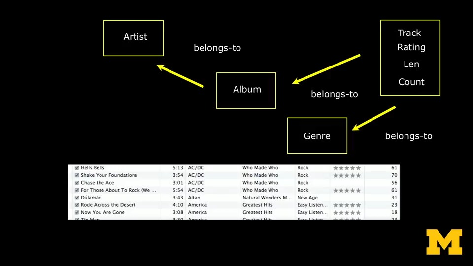

### Mapping

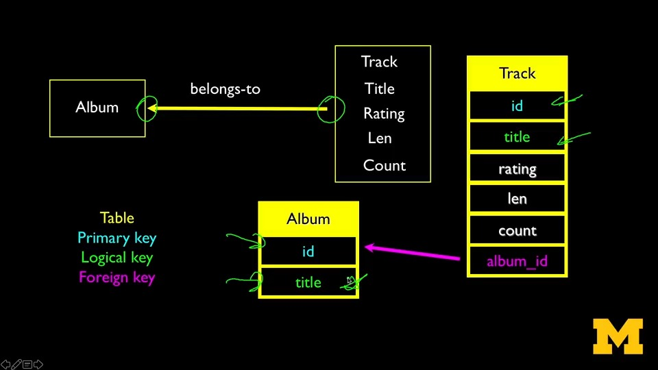

### Conceptual Design

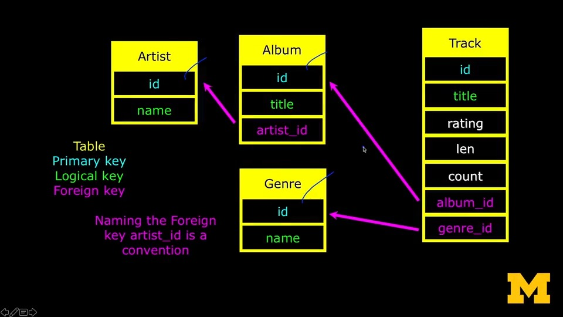

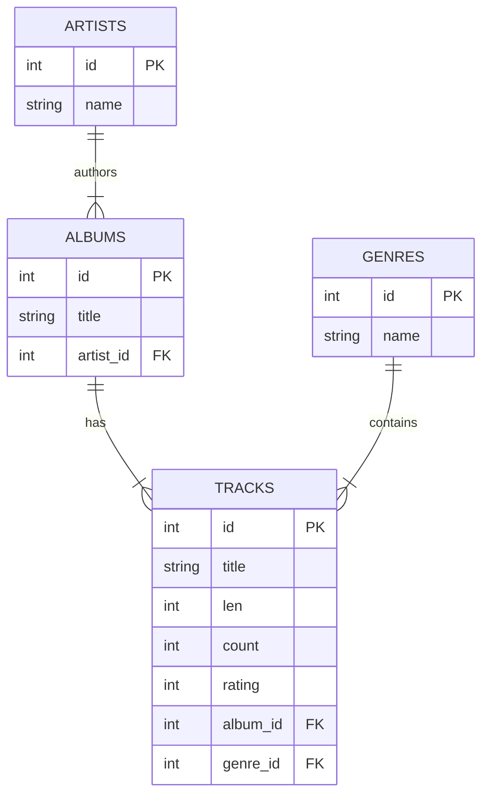
```mermaid
erDiagram
    TRACKS {
        int id PK
        string title
        int len
        int count
        int rating
        int album_id FK
        int genre_id FK
    }

    ALBUMS {
        int id PK
        string title
        int artist_id FK
    }

    ARTISTS {
        int id PK
        string name
    }

    GENRES {
        int id PK
        string name
    }


    ARTISTS ||--|{ ALBUMS : "authors"
    ALBUMS ||--|{ TRACKS : "has"
    GENRES ||--|{ TRACKS : "contains"
```

---

### PostgreSQL Implementation

```bash
# launch psql client
docker run -it --rm --network postgres-network postgres psql -h pgsql-server -U gyao music
```

```pgsql
/* table artists */
CREATE TABLE artists (
    id SERIAL,
    name VARCHAR(128),
    PRIMARY KEY(id)
);
/* table albums */
CREATE TABLE albums (
    id SERIAL,
    name VARCHAR(128),
    artist_id INTEGER REFERENCES artists (id) ON DELETE CASCADE,
    PRIMARY KEY(id),
);
/* table genres */
CREATE TABLE genres (
    id SERIAL,
    name VARCHAR(128),
    PRIMARY KEY(id)
);
/* table tracks */
CREATE TABLE tracks (
    id SERIAL,
    genre_id INTEGER REFERENCES genres (id) ON DELETE CASCADE,
    album_id INTEGER REFERENCES albums (id) ON DELETE CASCADE,
    title VARCHAR(128),
    len INTEGER,
    count INTEGER,
    rating INTEGER,
    PRIMARY KEY(id)
);
```

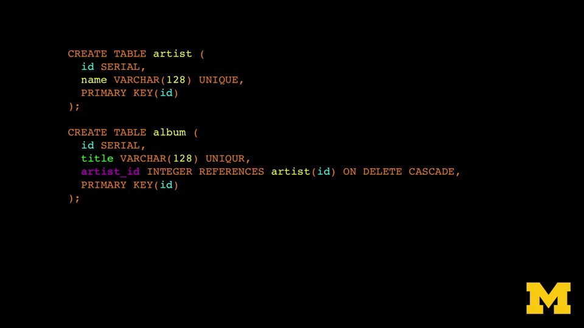

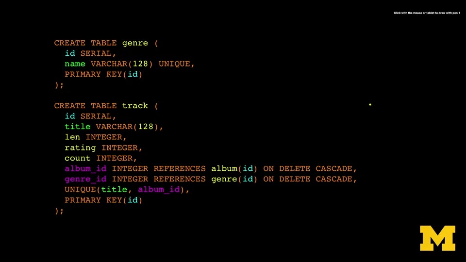

---

### Schema Design Inspection

```bash
# launch pgAdmin
docker run --name pgadmin --network postgres-network -p 80:80 \
    -e 'PGADMIN_DEFAULT_EMAIL=gyao@nvidia.com' \
    -e 'PGADMIN_DEFAULT_PASSWORD=gyao' \
    -d dpage/pgadmin4
```

The result schema diagram is as follows:

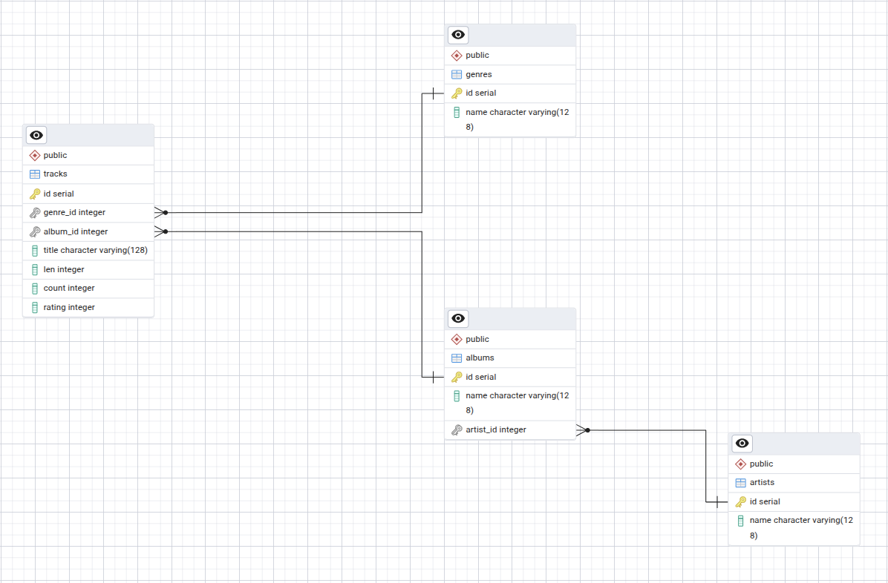

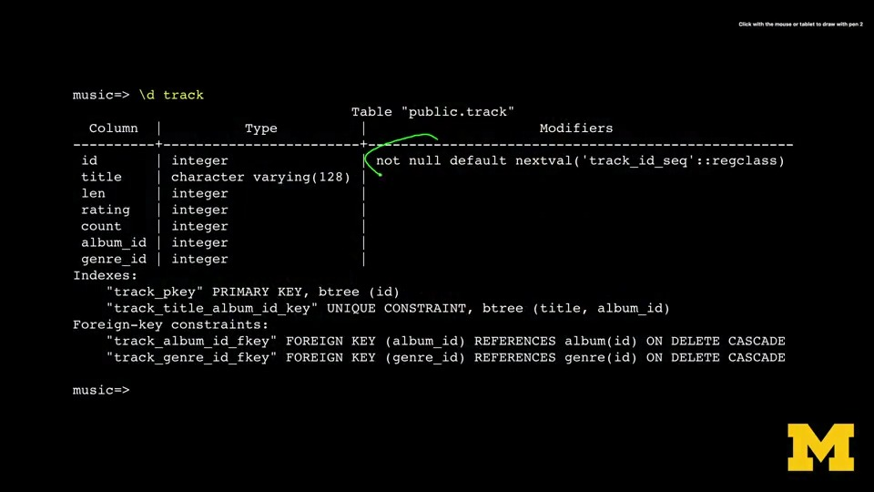

### Notes on Logical Key

For logical key, declaring the field as UNIQUE will let the server create a B-tree index automatically for it.

The unique index is typically beneficial for enforcing uniqueness (e.g., usernames, email addresses) and accelerating retrieval by the column.

- **Retrieval (select queries) by that field becomes faster**, because the optimizer can use the index to quickly locate rows.
- **Inserts and updates have extra overhead**, since PostgreSQL must check uniqueness and maintain the uniqueness constraint via the index.
- **Storing the index itself uses additional** disk space and memory overhead.

---

### Data Insertion

```pgsql
/* table artists */
INSERT INTO artists (name) VALUES ('Led Zeppelin');
INSERT INTO artists (name) VALUES ('AC/DC');
/* table albums */
INSERT INTO albums (name, artist_id) VALUES ('IV', 1);
INSERT INTO albums (name, artist_id) VALUES ('Who Made Who', 2);
/* table genres */
INSERT INTO genres (name) VALUES ('Rcok');
INSERT INTO genres (name) VALUES ('Metal');
/* table tracks */
INSERT INTO tracks (title, len, count, rating, album_id, genre_id) VALUES ('Who Made Who', 5, 207, 0, 1, 2);
```

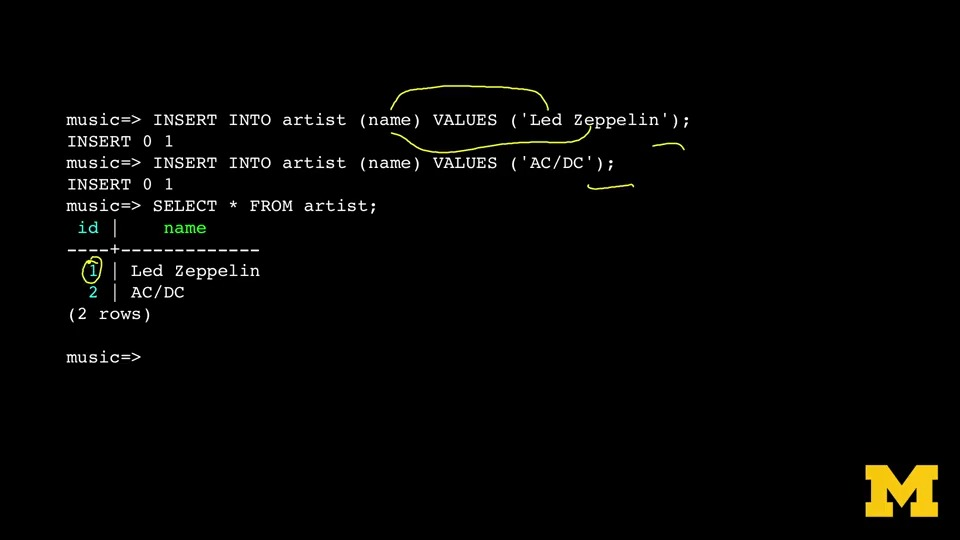

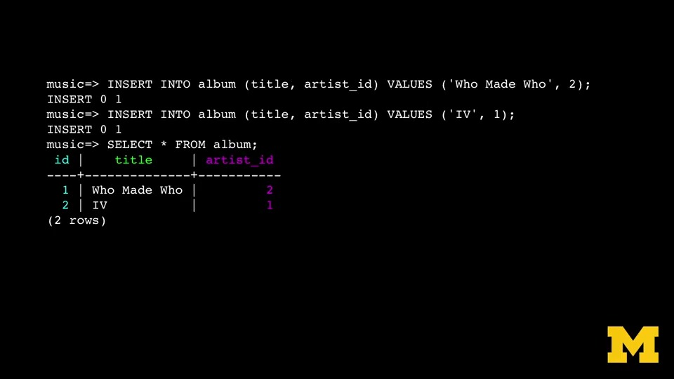

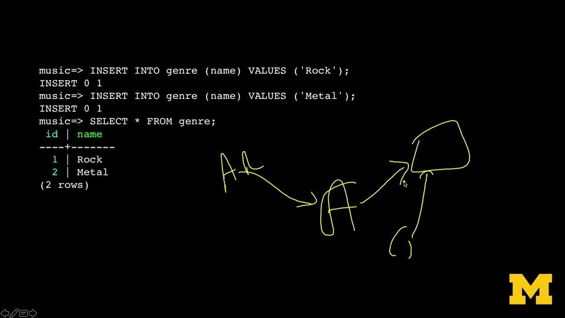

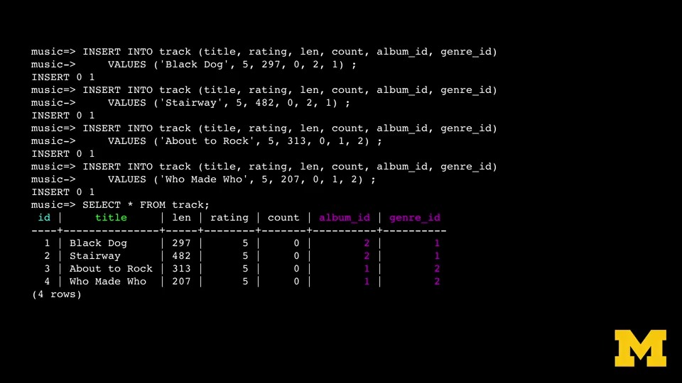

---

### Application Logic Access

#### Overview

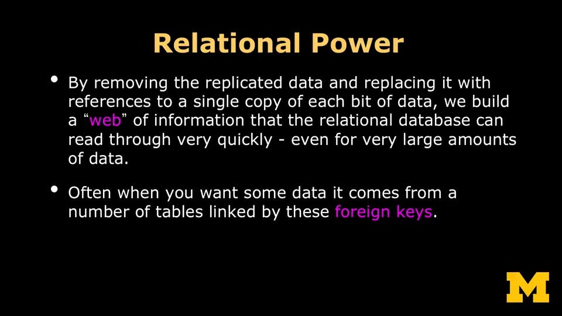

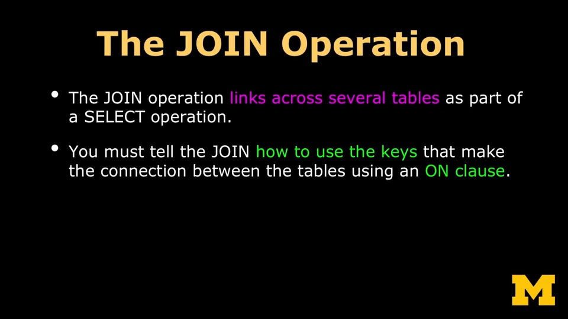

```pgsql
/* version 0 */
SELECT 
    A.artist, A.album, T.genre, T.title, T.len, T.rating, T.count
FROM (
    SELECT 
        artists.name AS artist,
        albums.name AS album,
        albums.id AS album_id
    FROM 
        albums INNER JOIN artists ON albums.artist_id = artists.id
) AS A INNER JOIN (
    SELECT 
        genres.name AS genre,
        tracks.title,
        tracks.len,
        tracks.rating,
        tracks.count,
        tracks.album_id
    FROM 
        tracks INNER JOIN genres ON tracks.genre_id = genres.id
) AS T ON A.album_id = T.album_id;

/* version 1 */
SELECT 
    artists.name AS artist, 
    albums.name AS album, 
    genres.name AS genre, 
    tracks.title, tracks.len, tracks.rating, tracks.count
FROM tracks
    INNER JOIN genres ON tracks.genre_id = genres.id
    INNER JOIN albums ON tracks.album_id = albums.id
    INNER JOIN artists ON albums.artist_id = artists.id;
```

---

## On Deletion Strategies

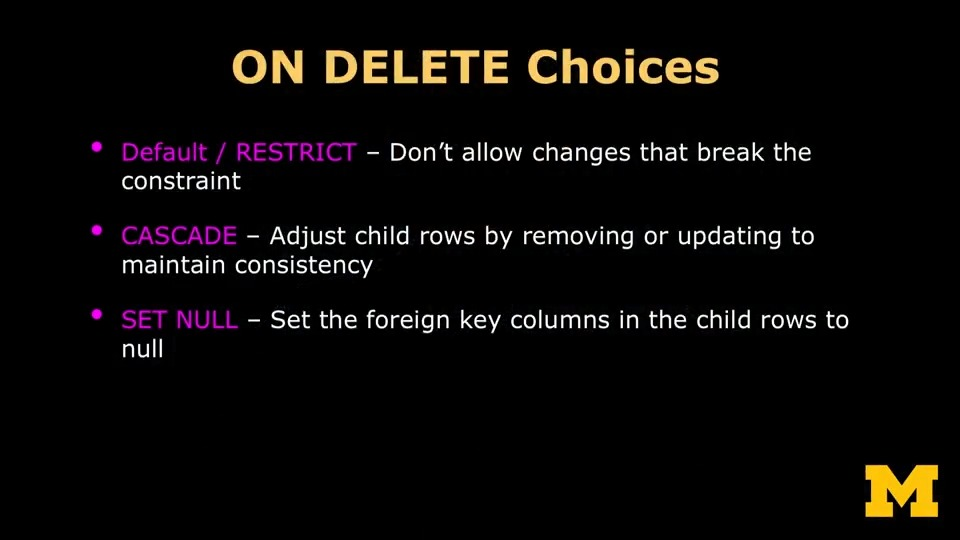

---

## Many-to-Many Relationship

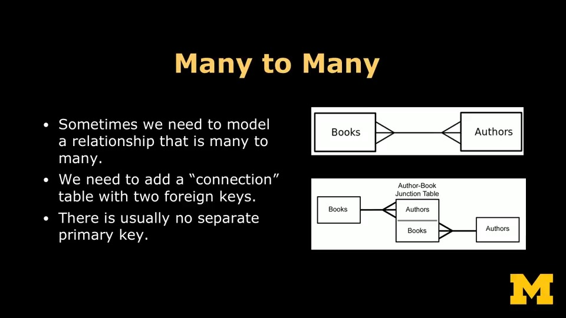

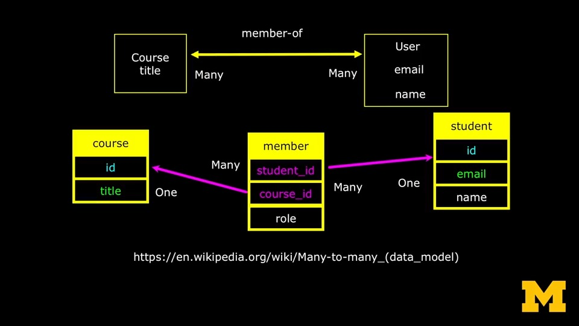

```pgsql
CREATE TABLE courses (
    id SERIAL,
    name VARCHAR(128),
    PRIMARY KEY(id)
);

CREATE TABLE students (
    id SERIAL,
    name VARCHAR(128),
    PRIMARY KEY(id)
);

CREATE TABLE members (
    course_id INTEGER REFERENCES courses (id) ON DELETE CASCADE,
    student_id INTEGER REFERENCES students (id) ON DELETE CASCADE,
    role INTEGER,
    PRIMARY KEY(course_id, student_id)
);
```

---

## Summary

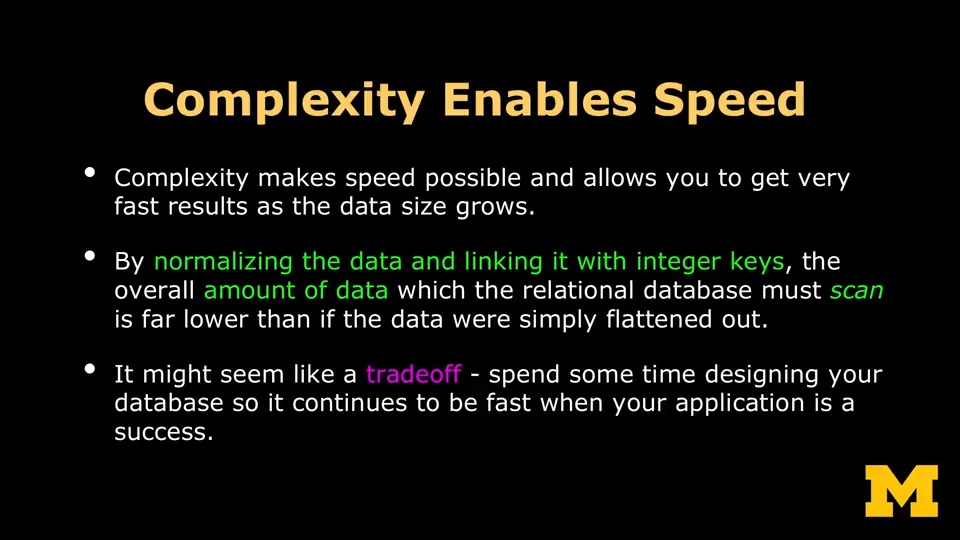