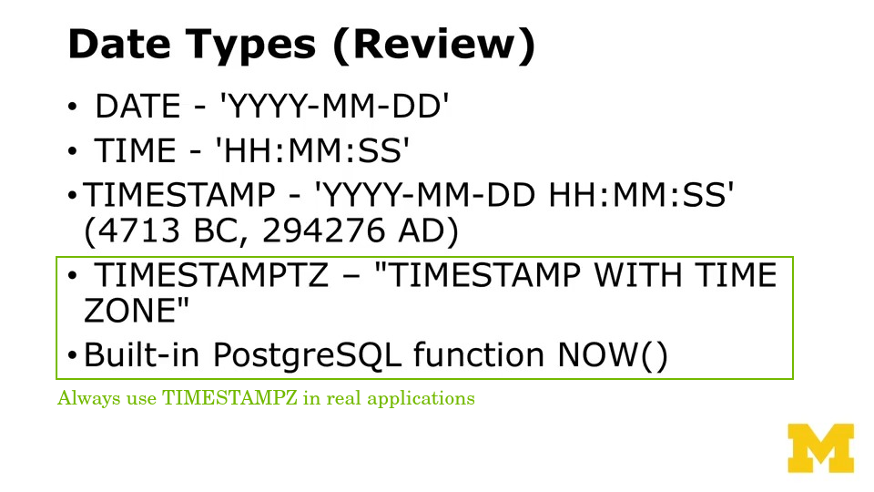
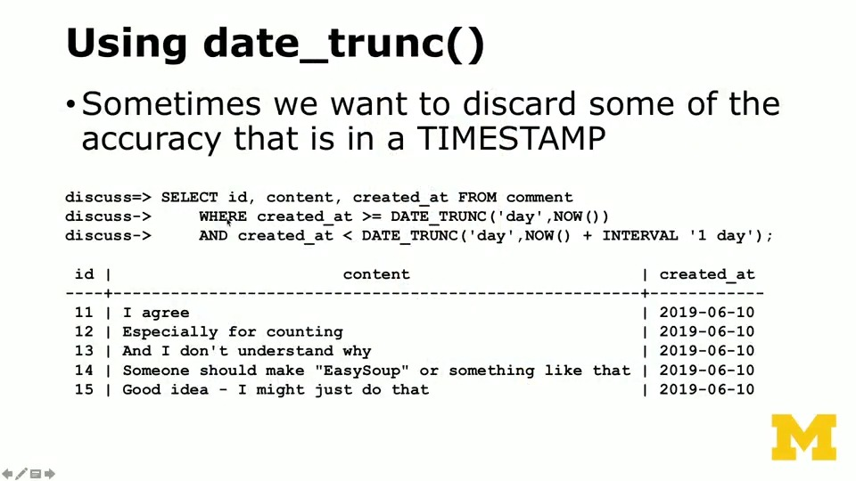

# Beyond CRUD

The Database Design and Basic SQL in PostgreSQL course by UMich through Coursera

---

## ALTER TABLE

```bash
docker run -it --rm postgres psql -h pg.pg4e.com -p 5432 -U pg4e_47e3719f9b pg4e_47e3719f9b
```


After creating the above tables, we can alter table schema using the following DDL even on a live database:


To alter the auto-incremental PRIMARY KEY, the following two options are available. Assume the following table is used:

```pgsql
CREATE TABLE accounts (
    id SERIAL,
    email VARCHAR(256) NOT NULL UNIQUE,
    balance NUMERIC(12, 2),
    PRIMARY KEY(id)
);
```

After clearning all the rows in the table, the auto-increment primary key should also be reset. To do this we can

```pgsql
-- option 1 - step by step
DELETE FROM accounts;
ALTER SEQUENCE accounts_id_seq RESTART WITH 1;
-- option 2 - all-in-one statement
TRUNCATE accounts RESTART IDENTITY;
```

In PGSQL usually the SERIAL PRIMARY KEY is built out of SEQUENCE data type. 

To see the actual sequence behind the primary key, we can use \d [TABLE_NAME] to inspect the table

```pgsql
music=# \d artists
                                    Table "public.artists"
 Column |          Type          | Collation | Nullable |               Default               
--------+------------------------+-----------+----------+-------------------------------------
 id     | integer                |           | not null | nextval('artists_id_seq'::regclass)
 name   | character varying(128) |           |          | 
Indexes:
    "artists_pkey" PRIMARY KEY, btree (id)
Referenced by:
    TABLE "albums" CONSTRAINT "albums_artist_id_fkey" FOREIGN KEY (artist_id) REFERENCES artists(id) ON DELETE CASCADE
```

---

## Read then Execute SQL Script

We can use **\i command** to load then execute [the SQL script](references/load-then-execute.sql) from file system.

```bash 
# launch psql client
docker run -it --rm --network postgres-network -v $PWD:/workspace postgres psql -h pgsql-server -U postgre
```

```pgsql
postgres=# \i /workspace/references/load-then-execute.sql 
CREATE TABLE
INSERT 0 3
 id |      email      | balance 
----+-----------------+---------
  1 | ed@umich.edu    |  100.00
  2 | sue@umich.edu   |  120.00
  3 | sally@umich.edu |  150.00
(3 rows)

DELETE 3
ALTER SEQUENCE
 id | email | balance 
----+-------+---------
(0 rows)

INSERT 0 3
 id |      email      | balance 
----+-----------------+---------
  1 | ed@umich.edu    |  120.00
  2 | sue@umich.edu   |  150.00
  3 | sally@umich.edu |  180.00
(3 rows)
```

---

## Date & Time




### Timezone


### Arithmatic


### Sub-Attribute Retrieval




---

## Sub-Queries

Below is a concise overview of some of the main reasons database professionals often recommend using subqueries sparingly or avoiding them in certain contexts. Note, however, that subqueries can be perfectly valid (and even optimal) in some situations. The goal is to be aware of potential downsides and consider alternatives (e.g., joins, Common Table Expressions, window functions) when possible.

### Potential Performance Issues 

- Subqueries can lead to poor query-planning or multiple scans of the same data, especially if used in the SELECT list or in correlated situations.  
- In some databases and query planners, repeated subqueries can cause the same logic to be executed multiple times. Joins, or a single pass with a well-formed query, may perform better.

### Readability and Maintainability  

- Large or deeply nested subqueries can make SQL statements harder to read and maintain.  
- Refactoring subqueries into either a CTE (WITH clause) or into joins can promote clearer logical structure, making it easier for others (or you in the future) to understand and debug the query.

### Reduced Opportunities for Index Use  

- Depending on how subqueries are written, some database engines may not use indexes as effectively. This can degrade performance when dealing with large datasets.  
- Writing explicit joins or using CTEs can sometimes make the query planner’s job simpler, enabling better use of existing indexes.

### Common Table Expressions (CTEs) Can Improve Clarity  

- Instead of embedding a subquery, you can define a CTE (WITH sub_query AS (...)) that pre-computes or isolates part of your logic. This can read more cleanly and still be optimized by the query planner.  
- CTEs are especially helpful if you need to reference the same derived data set multiple times without copying the same subquery logic everywhere.

```pgsql
-- multiple CTEs example
WITH orders_last_month AS (
SELECT customer_id, SUM(total) AS sum_total
FROM orders
WHERE order_date >= CURRENT_DATE - INTERVAL '30 days'
GROUP BY customer_id
),
high_value_customers AS (
SELECT customer_id
FROM orders_last_month
WHERE sum_total > 1000
)
SELECT
c.id AS customer_id,
c.name AS customer_name,
hvc.customer_id IS NOT NULL AS is_high_value
FROM customers c
LEFT JOIN high_value_customers hvc ON c.id = hvc.customer_id;
```

### Alternative Query Features  

- Window functions can provide aggregates over partitions of data without requiring subqueries.  
- These approaches sometimes offer improved performance or clarity, especially for analytics queries.

### Summary

Subqueries are not universally bad—indeed, in certain scenarios they are straightforward and perfectly fine. However, when performance or query clarity becomes an issue, consider joins, Common Table Expressions, or window functions. By doing so, you can help the query planner optimize more efficiently and maintain more readable, flexible SQL statements.

---

## Transaction

The database must be able to handle concurrent queries to ensure atomicity of each operation.


PostgreSQL uses **LOCK** to provide the atomicity needed to build the transaction abstraction.


### Transactional Statement

Each statement in PGSQL is a transaction.


We can also use **compound statement** for multiple operations in one transaction

- **Example: Capture Auto-Generated / Updated Value in Single Statement**
  
  

- **Example: Create or Update in Single Statement**
  
  

- **Example: Multi-Statement with Lock**

  

  The **FOR UPDATE** statement locks the relevant rows in current transaction and prevents other transactions from modifying them until current transaction is done.

  - Each selected row is locked at the row level (Row Exclusive Lock in PostgreSQL terms).
  
  - Other transactions trying to update or delete those locked rows must wait until your transaction completes (commits or rolls back).
  
  - By default, all referenced tables are locked if you simply use FOR UPDATE without “OF”. Using FOR UPDATE OF [table_name] restricts which tables’ rows get locked. 

  The lock strength can also be tweaked using options:

  - FOR UPDATE NOWAIT: If another transaction already has a conflicting lock, this query will fail immediately rather than waiting.
  
  - FOR UPDATE SKIP LOCKED: The query will skip rows that are locked by other transactions, which can be useful for concurrency patterns where you distribute work among multiple processes.

**NOTE**

The above compound statement is not supported by Python SQLAlchemy out of box. To leverage them, we can:

- Use the Core approach inside an ORM session via session.execute(statement).
- Construct a statement with the returning() method and then run it, retrieving the results as desired.

---

## Stored Procedures

### General Guidelines


### Checklist


### Example


