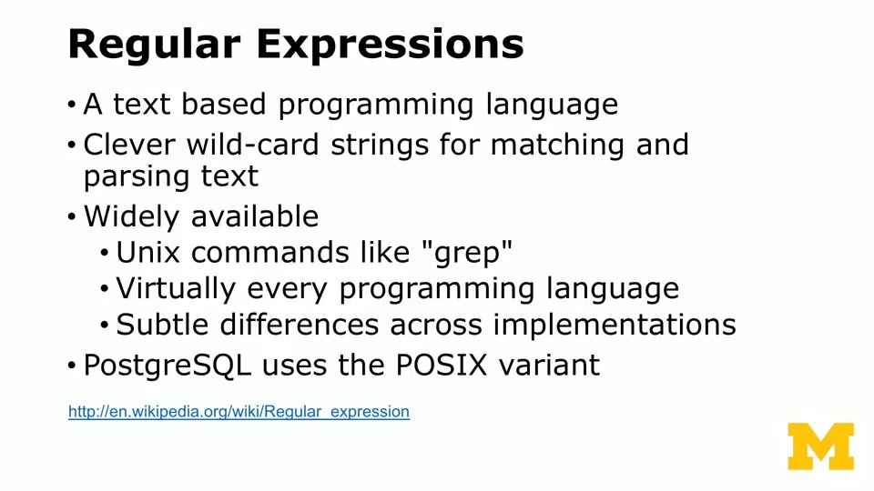

# Regex

The Intermediate PostgreSQL course by UMich through Coursera

---

## Connect to Course Database

### Set Up Docker

The content below is based on [this tutorial](https://www.docker.com/blog/how-to-use-the-postgres-docker-official-image/#Why-should-you-containerize-Postgres)

```bash
# fetch official image
docker pull postgres
# create network for client-server communication
docker network create postgres-network
# launch pgsql server in detached mode
# --name pgsql-server: name the container instance as pgsql-server
# --network postgres-network: attach the container to the specific network postgres-network
# -e POSTGRES_PASSWORD=postgres: during initialization, the super user postgres will be created. 
#                                its password is configured through this env var
# -d: run in detached mode
# postgres: using image postgres
docker run -d --name pgsql-server --network postgres-network -e POSTGRES_PASSWORD=postgres -p 5432:5432 postgres
# connect with psql cli
# --name pgsql-server: name the container instance as pgsql-server
# --network postgres-network: attach the container to the specific network postgres-network
# -e POSTGRES_PASSWORD=postgres: during initialization, the super user postgres will be created. 
#                                its password is configured through this env var
# -d: run in detached mode
# --rm: automatically removes the container instance when it exits
# -it: runs the container interactively with a terminal
# --network postgres-network: attach the container to the specific network postgres-network
# postgres: using image postgres, which contains the psql client
# psql -h pgsql-server -U postgres: login to psql server pgsql-server using super user postgres
docker run -it --rm --network postgres-network -v $PWD/references:/workspace postgres psql -h pgsql-server -p 5432 -U postgres
```

### Launch psql in Docker

```bash
# Host:     pg.pg4e.com 
# Port:     5432 
# Database: pg4e_87d51122eb 
# User:     pg4e_87d51122eb 
# Password: pg4e_p_92c9c1bc0099645
docker run -it --rm postgres psql -h pg.pg4e.com -p 5432 -U pg4e_87d51122eb pg4e_87d51122eb
```

---

## Overview




---

## Quick Guide

The official PostgreSQL document on its regular expression syntax is available [here](https://www.postgresql.org/docs/current/functions-matching.html#FUNCTIONS-POSIX-REGEXP)


### NOTE: The Difference Between Greedy and Non-Greedy Match

```python
import re

# greedy matching pattern
greedy_match_pattern = r'a.*b'
# non-greedy matching pattern
non_greedy_match_pattern = r'a.*?b'

# test string
test_string = 'a123b456b789'

# find the first match using greedy matching
greedy_match = re.search(pattern=greedy_match_pattern, string=test_string)
# find the frist match using non-greedy matching
non_greedy_match = re.search(pattern=non_greedy_match_pattern, string=test_string)

# check results
assert greedy_match is not None, "Greedy match failed"
assert greedy_match.group() == 'a123b456b', "Greedy match did not return expected result"

assert non_greedy_match is not None, "Non-greedy match failed"
assert non_greedy_match.group() == 'a123b', "Non-greedy match did not return expected result"

# Output:
# Greedy Matches: 'a123b456b'
# Non-Greedy Matches: 'a123b'
# Explanation:
# In the greedy match, the pattern 'a.*b' matches from the first 'a' to the last 'b', capturing everything in between.
# In the non-greedy match, the pattern 'a.*?b' captures the shortest possible string between 'a' and 'b', resulting in two matches.
```

---

## Case Analysis

### SUBSTRING


### REGEXP_MATCHES

See the example script below

```pgsql
-- create tweet table
DROP TABLE IF EXISTS tweet;

CREATE TABLE tweet (
    id SERIAL, 
    tweet TEXT,
    PRIMARY KEY(ID)
);

INSERT INTO tweet (tweet) VALUES
    ('This is #SQL and #FUN stuff!'),
    ('More people should learn #SQL from #CMU!'),
    ('#CMU also teaches #Database!');

-- find all hashtags in tweet
SELECT 
    id, 
    REGEXP_MATCHES(tweet, '#[A-Za-z0-9]+', 'g') AS hashtag
FROM 
    tweet;
```