# Beyond CRUD

The Intermediate PostgreSQL course by UMich through Coursera

---

## Connect to Course Database

### Set Up Docker

The content below is based on [this tutorial](https://www.docker.com/blog/how-to-use-the-postgres-docker-official-image/#Why-should-you-containerize-Postgres)

```bash
# fetch official image
docker pull postgres
# create network for client-server communication
docker network create postgres-network
# launch pgsql server in detached mode
# --name pgsql-server: name the container instance as pgsql-server
# --network postgres-network: attach the container to the specific network postgres-network
# -e POSTGRES_PASSWORD=postgres: during initialization, the super user postgres will be created. 
#                                its password is configured through this env var
# -d: run in detached mode
# postgres: using image postgres
docker run -d --name pgsql-server --network postgres-network -e POSTGRES_PASSWORD=postgres -p 5432:5432 postgres
# connect with psql cli
# --name pgsql-server: name the container instance as pgsql-server
# --network postgres-network: attach the container to the specific network postgres-network
# -e POSTGRES_PASSWORD=postgres: during initialization, the super user postgres will be created. 
#                                its password is configured through this env var
# -d: run in detached mode
# --rm: automatically removes the container instance when it exits
# -it: runs the container interactively with a terminal
# --network postgres-network: attach the container to the specific network postgres-network
# postgres: using image postgres, which contains the psql client
# psql -h pgsql-server -U postgres: login to psql server pgsql-server using super user postgres
docker run -it --rm --network postgres-network -v $PWD/references:/workspace postgres psql -h pgsql-server -p 5432 -U postgres
```

### Launch psql in Docker

```bash
# Host:     pg.pg4e.com 
# Port:     5432 
# Database: pg4e_87d51122eb 
# User:     pg4e_87d51122eb 
# Password: pg4e_p_92c9c1bc0099645
docker run -it --rm postgres psql -h pg.pg4e.com -p 5432 -U pg4e_87d51122eb pg4e_87d51122eb
```

---

## Text Functions

The full table of **String Functions and Operators** are available [here](https://www.postgresql.org/docs/current/functions-string.html). Below are the highlights from the courseware

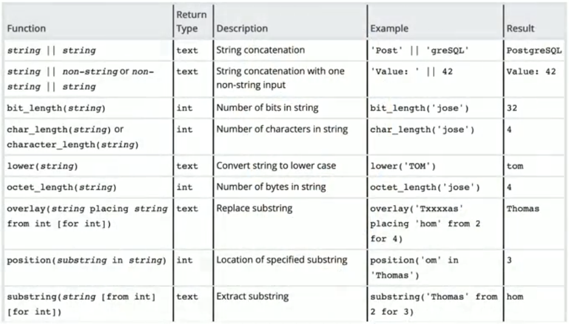

---

## Index Performance Analysis

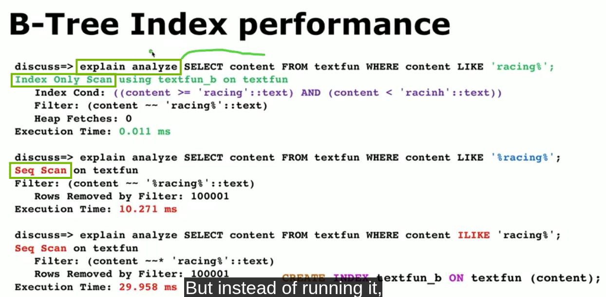

### Seq Scan

- **Definition** A Seq Scan means PostgreSQL is **reading all the rows (or all pages on disk) for a table sequentially**.  
- **When It Appears**
  - If PostgreSQL estimates (or knows) that filtering via an index would be more expensive than simply reading every row.
  - If there is no suitable index for the query’s WHERE clause.
  - If the table is so small that scanning it sequentially may be cheaper than setting up an index scan.  
- **Performance Notes**
  - Reading data blocks in sequential order can be very fast on large contiguous data sets, especially if you need to retrieve most or all of the table’s rows anyway.
  - On the other hand, scanning a massive table to retrieve a small subset of rows can be slower than an index-based access path.

### Index Only Scan

- **Definition** An Index Only Scan is a method where PostgreSQL can retrieve all required columns directly from an index without reading the corresponding table heap pages. This is possible only if:
  - The query references columns that are present in the index itself, AND
  - The “visibility map” indicates that all needed table rows are all-visible (i.e., vacuumed and not changed by uncommitted transactions).

- **When It Appears**
  - The planner sees that all the columns necessary for the query (SELECT and WHERE) exist in one index.
  - The database is well-maintained, so many table pages are marked as all-visible in the visibility map and do not require additional lookups into the table.  

- **Performance Notes**
  - Can be extremely fast, because data is read from the index structure alone.
  - If some tuple version checks fail (because of recently updated rows, for example), PostgreSQL may still need to visit certain pages in the underlying table, reducing the performance benefit.  

- **Key Benefit**
  - It avoids heap access altogether for rows that are known to be visible, saving significant I/O.  

### Comparison

- Seq Scan reads all pages of the table while applying any filters. This can be great if your query covers a large fraction of the table.  
- Index Only Scan uses an index to locate the needed rows (and possibly all the requested columns), often drastically reducing I/O if your result set is smaller than the table size or if you only need indexed columns.  
- An Index Only Scan can fail to skip the heap if too many pages aren’t marked “all-visible,” in which case it partially degrades to a normal index scan (which still reads table pages, but only the relevant ones).  
- For read-heavy workloads on colums that do not change frequently, maintaining a big, covering index and vacuuming regularly can turn many queries into index only scans.

### Examples

All the examples below are executed on the sample table created by [create-text-table](references/create-text-table.sql)

#### Full Seq Scan
```pgsql
text=# explain analyze SELECT content FROM text_table WHERE content LIKE '%150000%';
                                               QUERY PLAN                                                
---------------------------------------------------------------------------------------------------------
 Seq Scan on text_table  (cost=0.00..2084.01 rows=10 width=33) (actual time=3.749..7.397 rows=1 loops=1)
   Filter: (content ~~ '%150000%'::text)
   Rows Removed by Filter: 100000
 Planning Time: 0.060 ms
 Execution Time: 7.407 ms
(5 rows)
```

#### Seq Scan with Filter
```pgsql
text=# explain analyze SELECT content FROM text_table WHERE content LIKE '%150000%' LIMIT 1;
                                                  QUERY PLAN                                                   
---------------------------------------------------------------------------------------------------------------
 Limit  (cost=0.00..208.40 rows=1 width=33) (actual time=3.829..3.829 rows=1 loops=1)
   ->  Seq Scan on text_table  (cost=0.00..2084.01 rows=10 width=33) (actual time=3.828..3.828 rows=1 loops=1)
         Filter: (content ~~ '%150000%'::text)
         Rows Removed by Filter: 50000
 Planning Time: 0.066 ms
 Execution Time: 3.837 ms
(6 rows)
```

#### Index Only Scan for Exact Matching
```pgsql
text=# explain analyze SELECT content FROM text_table WHERE content in ('https://www.pg4e.com/lemon/16004', 'https://www.pg4e.com/neon/100008');
                                                               QUERY PLAN                                                                
-----------------------------------------------------------------------------------------------------------------------------------------
 Index Only Scan using idx_text_table_content on text_table  (cost=0.42..8.87 rows=2 width=33) (actual time=0.028..0.028 rows=0 loops=1)
   Index Cond: (content = ANY ('{https://www.pg4e.com/lemon/16004,https://www.pg4e.com/neon/100008}'::text[]))
   Heap Fetches: 0
 Planning Time: 0.098 ms
 Execution Time: 0.035 ms
(5 rows)
```

#### Avoid Sub-Queries

```pgsql
text=# explain analyze SELECT content FROM text_table WHERE content in (SELECT content FROM text_table WHERE content LIKE 'https://www.pg4e.com/lemon/16000%');
                                                                  QUERY PLAN                                                                   
-----------------------------------------------------------------------------------------------------------------------------------------------
 Nested Loop  (cost=2084.45..2128.59 rows=10 width=33) (actual time=6.185..6.199 rows=3 loops=1)
   ->  HashAggregate  (cost=2084.04..2084.14 rows=10 width=33) (actual time=6.162..6.163 rows=3 loops=1)
         Group Key: text_table_1.content
         Batches: 1  Memory Usage: 24kB
         ->  Seq Scan on text_table text_table_1  (cost=0.00..2084.01 rows=10 width=33) (actual time=3.712..6.157 rows=3 loops=1)
               Filter: (content ~~ 'https://www.pg4e.com/lemon/16000%'::text)
               Rows Removed by Filter: 99998
   ->  Index Only Scan using idx_text_table_content on text_table  (cost=0.42..4.44 rows=1 width=33) (actual time=0.011..0.011 rows=1 loops=3)
         Index Cond: (content = text_table_1.content)
         Heap Fetches: 0
 Planning Time: 0.173 ms
 Execution Time: 6.216 ms
(12 rows)
```
---

## Character Set

### ASCII Set

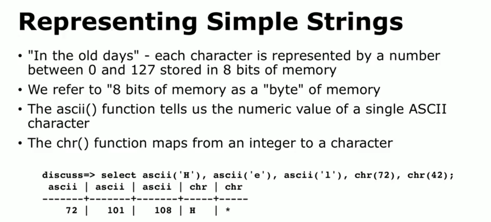

### Unicode Abstract Character Set

- **Conceptual Definition** Unicode is a standard for defining characters, not just for English, but for virtually all languages, scripts, and symbols in the world. It defines **a unique code point (an integer) for each character in its repertoire**.
- **Abstraction** These code points are an abstract notion - **they aren’t tied to a specific byte-level representation. Instead, they are like the “ID” for each character**.

See the latest version of Unicode Character Set [here](http://unicode.org/charts/)

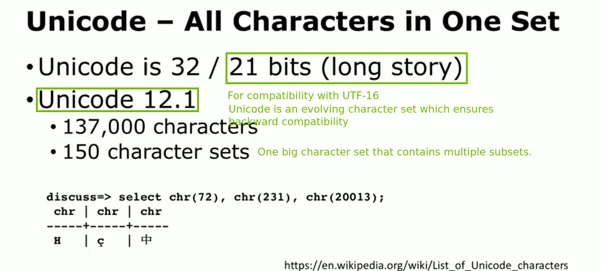

### UTF-8 Character Set - A Specific Encoding of Unicode

- **UTF-8 (Unicode Transformation Format - 8)** is an encoding scheme that takes the abstract code points from Unicode and encodes them into a sequence of bytes (8-bit units).

- **Variable-Length** A code point can be encoded in 1 to 4 bytes, depending on its value. For example:
  - Most common ASCII characters (U+0000 to U+007F) require just 1 byte.
  - Many European, Middle Eastern, and Asian characters use 2 or 3 bytes.
  - Rare or historic scripts, and many emoji, can use 4 bytes.

- **Ubiquity** Due to its efficiency with ASCII-based text, UTF-8 dominates web content and is the standard encoding on most modern platforms.

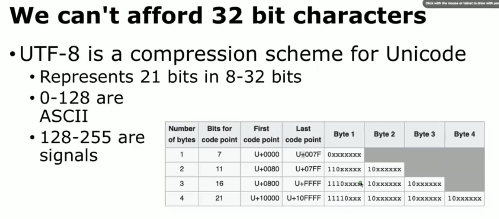

We can probe into UTF-8 character set in PostgreSQL as follows:

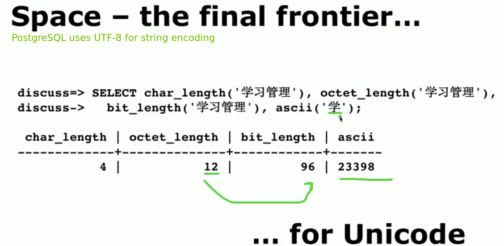

### Trending of Character Sets

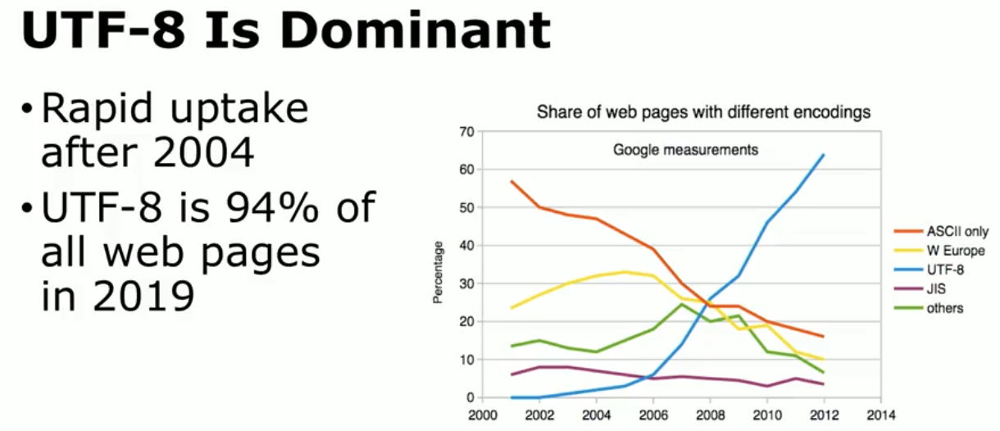

---

## Character Set in Python 3

One of the biggest design choices in Python 3 is that **every string should be encoded in Unicode**.

Starting with Python 3.3, CPython uses a dynamic internal representation for strings (PEP 393: Flexible String Representation), choosing the most memory-efficient layout for each string. For instance:

- If all characters in the string fit in the ASCII range (U+0000 to U+007F), Python may store them in 1 byte per character.
- If the string contains characters from the Basic Multilingual Plane (roughly up to U+FFFF), Python can store them in 2 bytes per character.
- Otherwise, it may use 4 bytes per character.

Regardless of whether it’s 1, 2, or 4 bytes in memory, Python code handles it through a single consistent abstraction: **a Unicode string**.

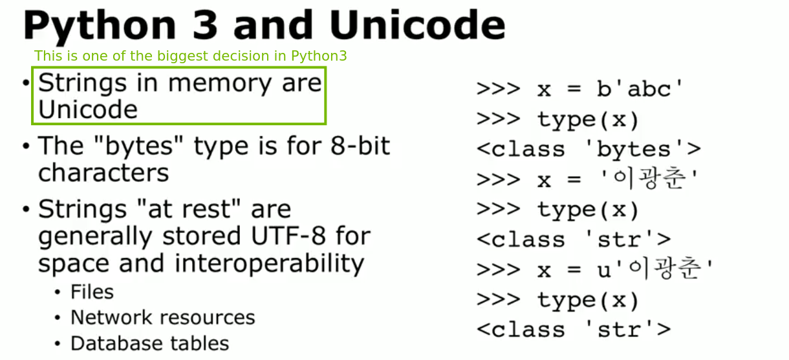

Thus, when doing I/O Python needs serialization and de-serialization between its internal Unicode string and the specific byte encoding expected by the external system.

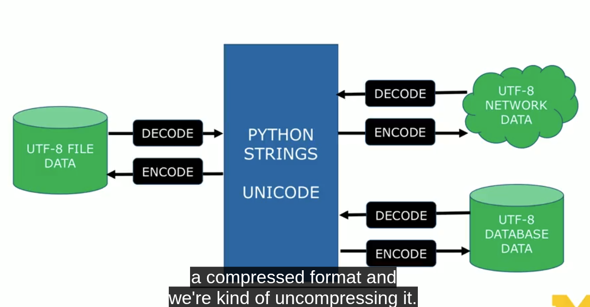

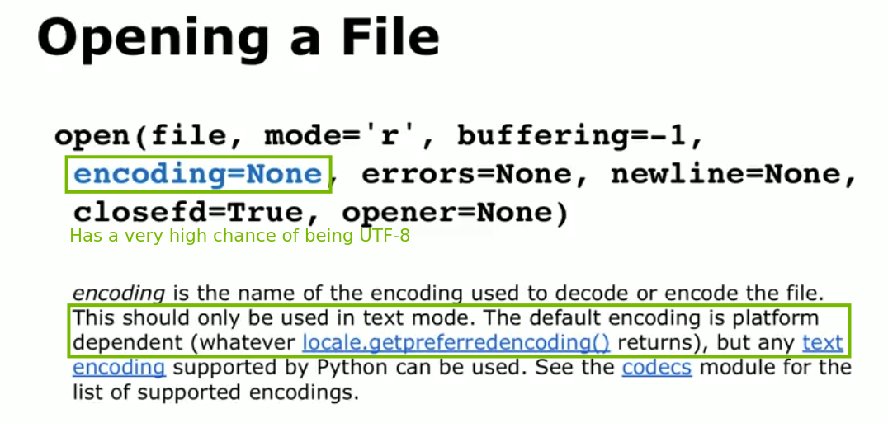

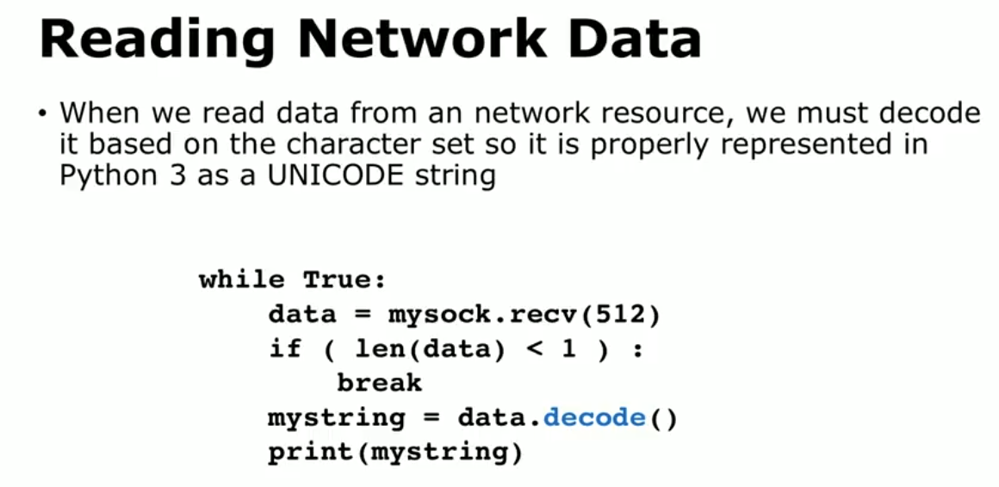

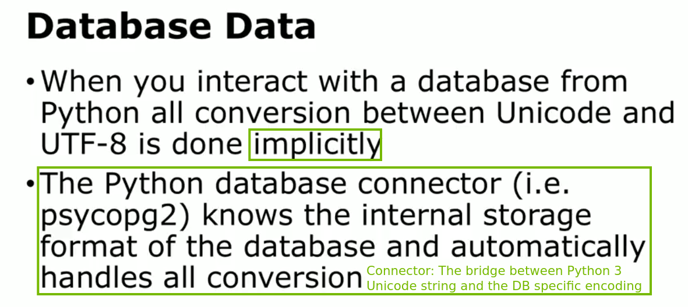

---

## Hash Function

### Definition

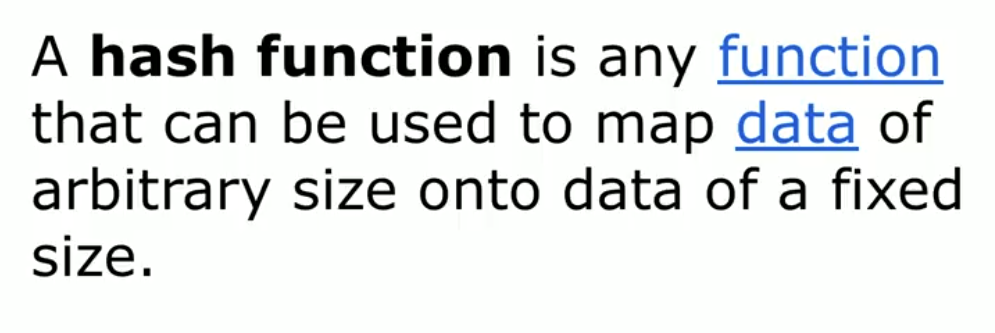

### Requirements

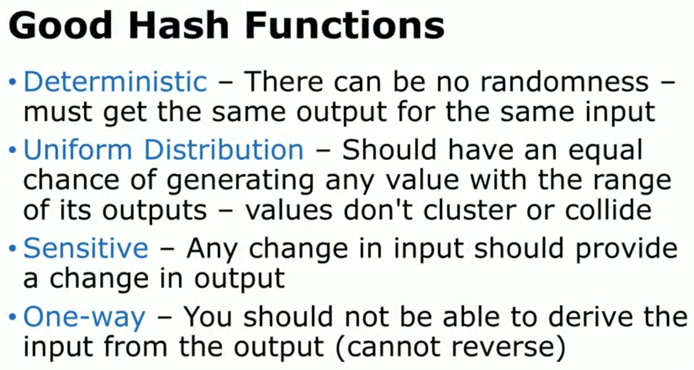

### Non-Cryptographic / Cryptographic Hash

- **Checksums / Non-Cryptographic Hash**
  - Designed for **integrity check** Should detect incidental data corruption, but do not provide robust resistance to malicious alterations.
  - Simpler and faster, requiring fewer computational steps.
  - Good at detecting random or accidental changes to data.
  - Not collision-resistant for adversarial scenarios: an attacker can often deliberately craft collisions or modifications that pass the same checksum.

- **Cryptographic Hash**
  - Designed with **strong security properties** (collision resistance, preimage resistance).
  - Collision Resistance: It’s extremely hard to find two different inputs producing the same hash.
  - Preimage Resistance: Given a hash output, it’s infeasible to reverse-engineer the original input.

### Standardization

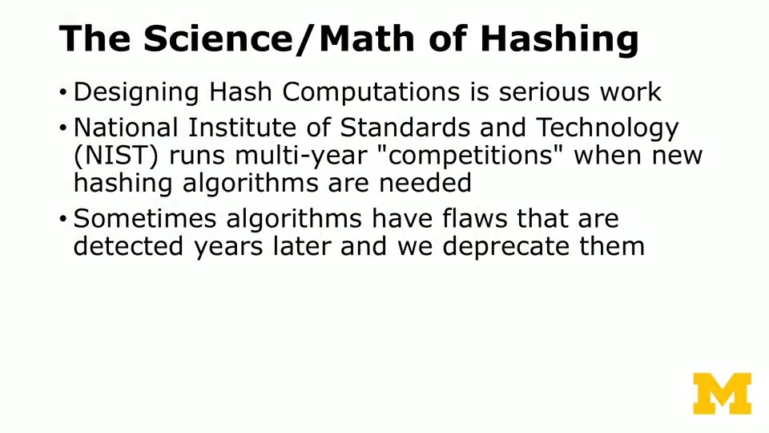

---

## Introduction to PostgreSQL Indices

Below is a beginner-friendly overview of some of the most commonly used Postgres index types. Each section briefly explains (1) the underlying data structure, (2) typical scenarios where that index excels, and (3) relevant performance overhead considerations.


### B-Tree Index

- Underlying Data Structure
  - A balanced tree structure (the “B-Tree”), where data is stored in sorted order. Each node has pointers to child nodes, ensuring lookups occur in O(log n) time on average.

- Typical Application Scenarios  
  - Most common index type (the default in Postgres).  
  - Great for **equality filters** (e.g., WHERE column = value) and **range queries** (e.g., BETWEEN, >, < operators).  
  - Often used for **primary key** and **unique constraints**.

- Performance Overhead  
  - Moderately sized overhead for writes (INSERT/UPDATE/DELETE) because the B-Tree must remain balanced.  
  - Generally **small storage overhead**, as B-Trees are quite space-efficient.  
  - Good all-around performance, making them **the go-to choice** for many typical queries.

- Refer to [B-Tree Index Wikipedia](https://en.wikipedia.org/wiki/B-tree) for an in-depth introduction to B-Tree.

### Hash Index

- Underlying Data Structure  
  - Uses a hash table concept internally, distributing keys across buckets using a hash function.

- Typical Application Scenarios
  - Strict equality lookups (e.g., WHERE column = value).
  - Historically less common, as they require careful concurrency support. Since Postgres 10+, they’re WAL-logged and more robust, but still used less frequently than B-Tree.

- Performance Overhead
  - Potentially **very fast lookups for exact matches**.
  - **No ordering** -> can’t optimize range queries.
  - Slightly higher overhead for writes and for space usage on large tables.  

### GIN (Generalized Inverted Index)

- Underlying Data Structure
  - An inverted index that stores a mapping from individual elements (like tokens, array elements) back to the rows that contain them.

- Typical Application Scenarios
  - Full-text search (e.g., searching for words in documents).
  - Arrays and JSONB containment queries (e.g., finding rows containing certain elements).
  - Great when you need to index multiple “values” within one column (like a list of tokens in text).

- Performance Overhead
  - Can be large in size because every token or element is indexed.
  - Updates and inserts can be more expensive if the data contains lots of tokens or array items.
  - Read performance is excellent for membership/containment or “text includes these words” queries.

### GiST (Generalized Search Tree)

- Underlying Data Structure
  - A balanced, tree-like structure but more flexible than B-Trees. The nodes can store bounding shapes or other geometric descriptors.

- Typical Application Scenarios
  - **Geospatial queries** with PostGIS (points, polygons, etc.).
  - Range types (e.g., time ranges, numeric ranges).
  - Fuzzy text matching (via trigram indices).
  - Advanced data types that rely on **bounding or partial overlap logic**.

- Performance Overhead
  - Inserting or updating data requires recalculating the bounding or partial overlap criteria, which can be more expensive than a B-Tree.
  - Index size can become large, depending on the complexity of the bounding data.
  - Excellent for queries that rely on “overlaps,” “contains,” or “nearest neighbor” operations.

### BRIN (Block Range Index)

- Underlying Data Structure
  - Stores **“summary” metadata for block ranges** (e.g., min/max values in each block of a table) rather than storing every indexed value.
  
- Typical Application Scenarios  
  - Very large, “naturally ordered” tables such as time-series data or log tables.
  - Queries that often filter on ranges that align well with physical ordering of the table (e.g., a timestamp column).
  - Minimizes index size while still allowing partial scans.

- Performance Overhead
  - Very small disk space usage (compared to B-Tree or others).
  - Extremely fast to create and maintain (especially on large tables).
  - Less precise than a B-Tree (may cause “false positives,” requiring extra row checks but still greatly reduces scans on large data sets).

- Refer to [Block Range Index Wikipedia](https://en.wikipedia.org/wiki/Block_Range_Index) for an in-depth introduction to BRIN.

### Summary

1. **B-Tree** is the universal default - balanced lookups and range queries.  
2. **Hash** is specialized for exact-match lookups.  
3. **GIN** is perfect for full-text search, arrays, and JSONB containment queries.  
4. **GiST** is well-suited for geospatial and other “range/overlap” data types.  
5. **BRIN** is efficient for large “naturally ordered” data, offering lightweight indexing at the cost of some lookup precision.  

In general, you choose your index type based on

- The nature of your data (is it text, geospatial, numeric ranges, etc.) and 
- The types of queries you’ll run (range queries, exact matches, full-text searches, etc.).

### Example

```pgsql
-- psql script: Demonstrates creation of different PostgreSQL indices
-- ---------------------------------------------------------
-- Usage Notes:
-- ---------------------------------------------------------
--   1) Adjust column names/types to suit your schema.
--   2) Consider the data distribution and queries to pick the right index type:
--      - B-Tree: The most common and default index type, suitable for equality and range queries in general-purpose scenarios.
--      - Hash: It is specialized for strict equality checks but is less versatile than B-Tree.  
--      - GIN: The ideal choice for searching within composite data types like arrays, JSONB, or full-text. 
--      - GiST: It excels at geospatial or range-based queries using bounding or overlap logic.
--      - BRIN: It offers space-efficient indexing for very large tables that are physically ordered (like time-series data), providing approximate filtering at low overhead.
--
--   3) Remember to ANALYZE or run auto-vacuum to keep statistics current, which helps
--      the Postgres planner use your indexes effectively.

-- Example schema:
CREATE TABLE IF NOT EXISTS generations (
    id SERIAL,
    author VARCHAR(128),
    created_at DATE,
    likes INT,
    content TEXT,    -- Could be for full-text, JSONB, etc. if you adapt this script
    region geometry, -- If you have PostGIS enabled (used by GiST index example below)
    PRIMARY KEY(id)
);

-- ---------------------------------------------------------
-- 1) B-Tree Index (Default)
-- ---------------------------------------------------------
-- Best for:
--   • Equality lookups (likes = some_value)
--   • Range queries (likes > X, likes BETWEEN X AND Y)
--   • Ordering and sorting improvements
-- 
CREATE INDEX idx_generations_likes_btree ON generations USING btree (likes);

-- ---------------------------------------------------------
-- 2) Hash Index
-- ---------------------------------------------------------
-- Best for:
--   • Strict equality queries (WHERE author = 'some@nvidia.com')
-- Caution:
--   • Not typically used for range queries
--   • Slightly more specialized, historically less popular than B-Tree
--
CREATE INDEX idx_generations_author_hash ON generations USING hash (author);

-- ---------------------------------------------------------
-- 3) GIN (Generalized Inverted Index)
-- ---------------------------------------------------------
-- Best for:
--   • Full-text search, JSONB containment queries, array membership
--   • Searching for tokens in text (tsvector) or elements in arrays
-- 
-- Example: Suppose content is used for full-text search:
--
-- You may need to install the postgres extension for text search, e.g.:
--   CREATE EXTENSION IF NOT EXISTS pg_trgm;  -- For trigram, if desired
-- Or for full text search, you would typically store a tsvector in a separate column
-- or generate it on the fly.
-- 
CREATE INDEX idx_generations_content_gin ON generations USING gin (to_tsvector('english', content));

-- ---------------------------------------------------------
-- 4) GiST (Generalized Search Tree)
-- ---------------------------------------------------------
-- Best for:
--   • Geospatial data (PostGIS) or geometry points, polygons, lines, etc.
--   • Ranges (date ranges, numeric ranges) and "overlaps" queries
--   • Nearest-neighbor, bounding box queries
--
CREATE INDEX idx_generations_region_gist ON generations USING gist (region);

-- ---------------------------------------------------------
-- 5) BRIN (Block Range Index)
-- ---------------------------------------------------------
-- Best for:
--   • Very large tables that have “naturally ordered” columns (e.g., date or timestamp)
--   • Minimizing disk usage while still filtering data range quickly
--   • Time-series or logs where created_at is chronological
--
CREATE INDEX idx_generations_created_at_brin ON generations USING brin (created_at);
```