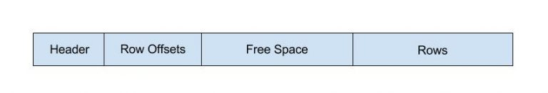
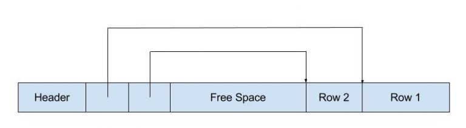
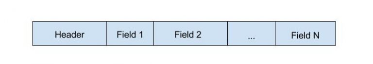

# Introduction to Inverted Index

---

## Set Up Environment

The content below is based on [this tutorial](https://www.docker.com/blog/how-to-use-the-postgres-docker-official-image/#Why-should-you-containerize-Postgres)

### Local Sandbox Database

```bash
# fetch official image
docker pull postgres
# create network for client-server communication
docker network create postgres-network
# launch pgsql server in detached mode
# --name pgsql-server: name the container instance as pgsql-server
# --network postgres-network: attach the container to the specific network postgres-network
# -e POSTGRES_PASSWORD=postgres: during initialization, the super user postgres will be created. 
#                                its password is configured through this env var
# -d: run in detached mode
# postgres: using image postgres
docker run -d --name pgsql-server --network postgres-network -e POSTGRES_PASSWORD=postgres -p 5432:5432 postgres
# connect with psql cli
# --name pgsql-server: name the container instance as pgsql-server
# --network postgres-network: attach the container to the specific network postgres-network
# -e POSTGRES_PASSWORD=postgres: during initialization, the super user postgres will be created. 
#                                its password is configured through this env var
# -d: run in detached mode
# --rm: automatically removes the container instance when it exits
# -it: runs the container interactively with a terminal
# --network postgres-network: attach the container to the specific network postgres-network
# postgres: using image postgres, which contains the psql client
# psql -h pgsql-server -U postgres: login to psql server pgsql-server using super user postgres
docker run -it --rm --network postgres-network -v $PWD/references:/workspace postgres psql -h pgsql-server -p 5432 -U postgres
```

### Course Assignment Database

```bash
# Host:     pg.pg4e.com 
# Port:     5432 
# Database: pg4e_b0429fdfdf 
# User:     pg4e_b0429fdfdf 
# Password: pg4e_p_63e777959d7b58a
psql -h pg.pg4e.com -p 5432 -U pg4e_b0429fdfdf pg4e_b0429fdfdf
```

---

## PostgreSQL On-Disk Storage Overview

Below are the top design choices of PostgreSQL on-disk storage. See the original blog post [here](https://malisper.me/the-file-layout-of-postgres-tables/)

1) Table-to-Files Mapping  
  - Each table is represented by one or more physical files.  
  - Files are segmented at 1 GB, thus large tables are split into multiple 1 GB chunks.  

2) Locating the Files  
  - **SHOW DATA_DIRECTORY** reveals where the Postgres cluster stores database files.  
  - **SELECT pg_relation_filepath('tablename')** shows the relative path of the table’s files within the data directory.  

3) 8 KB Pages  
  - Each file is broken into 8 KB “pages,” the fundamental I/O unit for Postgres.  
  - Queries that fetch data from disk read or write in page-sized chunks, not individual rows.  

4) Page Layout  
  - A page contains a 24-byte header (including metadata/checksum), row offsets (pointers), and the rows themselves.  
  - Row offsets grow from the start of free space, while the actual row data grows from the end of free space, converging in the middle.  
  - 
  - 
  - 
  - The above page layout can be inspected by the following query:
    ```pgsql
    SELECT ctid, * from bar;
    ```
  - The best page size is determined mainly by the underlying persistent storage type
    - For SSD smaller page sizes such as 4K and 8K can be used
    - For 

5) Row Storage  
  - Each row has a 23-byte header carrying transaction IDs (for MVCC) and other metadata.  
  - Fixed-width fields are stored directly in the row; variable-width fields often include a length header.  
  - Very large fields may be stored outside the page using **TOAST**.  
  - 

6) I/O Behavior  
  - Postgres reads and writes entire pages at a time (disk-memory IO and in-memory caching) to ensure efficient data access.
  - Page is the unit of locking for transactional consistency.  
  - Direct manual manipulation of files is strongly discouraged due to high risk of corruption.  

This design - splitting tables into 1 GB file segments, using uniform 8 KB pages for I/O, and grouping multiple rows per page - helps Postgres efficiently manage data at scale while maintaining transactional safety.

### The Oversized Attribute Storage Technique, TOAST

Below is a concise, sequential set of key points from the blog post, reflecting the design choices behind TOAST (“The Oversized Attribute Storage Technique”) in PostgreSQL. The original blog post is available [here](https://malisper.me/postgres-toast/)

1) Purpose of TOAST  
  - Allows PostgreSQL to handle values larger than the 8 KB page size limit.  
  - Transparently stores large fields (“TOASTed” data) outside the main table row when they exceed ~2 KB.

2) Compression and Chunking  
  - If a row exceeds ~2 KB, PostgreSQL first compresses large variable-width fields.  
  - If still above the threshold, the large fields are split into ~2 KB chunks, each stored in a separate “TOAST table.”

3) TOAST Table Structure  
  - Every regular table that can contain large fields has a corresponding TOAST table.  
  - The TOAST table includes three columns:  
    - chunk_id (identifies which large value the chunk belongs to),  
    - chunk_seq (the chunk’s position within the value),  
    - chunk_data (the binary/compressed chunk contents).

4) Query-Time Retrieval  
  - PostgreSQL uses an index on (chunk_id, chunk_seq) to fetch all chunks belonging to a specific value in order.  
  - The chunks are then stitched back together and decompressed to reconstruct the original data.

5) Performance Benefit  
  - If a query does not reference the TOASTed field, PostgreSQL can skip loading its chunks from disk.  
  - This on-demand retrieval reduces disk I/O and speeds queries where the large field is unnecessary.

6) Direct Inspection  
  - The corresponding TOAST table’s name can be found via pg_class metadata.  
  ```pgsql
  SELECT reltoastrelid::regclass 
  FROM pg_class 
  WHERE relname = '[TABLE_NAME]';
        reltoastrelid      
  -------------------------
  pg_toast.pg_toast_59611
  (1 row)
  ```
  - You can SELECT from that TOAST table to see individual chunks (though the data is stored in binary form).
  ```pgsql
  SELECT * FROM pg_toast.pg_toast_59611;
  chunk_id | chunk_seq | chunk_data
  ----------+-----------+------------
      59617 |         0 | \x4c4457...
      59617 |         1 | \x424d4b...
  ...
  ```

7) User Transparency  
  - TOAST operates behind the scenes, freeing users from manually handling oversized columns.  
  - For advanced troubleshooting or deeper inspection, the raw TOAST table is accessible just like any other table.

### Table File Structure in Depth

Below is the summary of [the blog post](https://rachbelaid.com/introduction-to-postgres-physical-storage/) which provides a deep dive into the file structure behind PostgreSQL tables.

1) Database OIDs and “oid2name” Utility  
  - Beyond querying pg_database for database OIDs, PostgreSQL also provides the oid2name command-line tool to examine the file structure of databases.
    ```pgsql
    select oid, datname from pg_database;

      oid  |   datname
    -------+-------------
        1 | template1
    12398 | template0
    12403 | postgres
    17447 | foo
    ```  
  - This can help correlate the numeric IDs in your file tree (e.g., in PGDATA/base) with human-readable database names.

2) Relfilenode vs. OID Mismatch  
  - Although a table’s relfilenode often matches its OID, they can differ (e.g., after certain DDL operations).  
  - You must check pg_class or use pg_relation_filenode(...), rather than assume both identifiers are always the same.

3) Free Space Map (FSM) Files  
  - Each table has a corresponding FSM file named filenode_fsm.  
  - PostgreSQL tracks approximate free space in pages (to about 32 bytes of precision under an 8 KB page size).  
  - Vacuum processes update the FSM so future inserts or updates know which pages can accommodate additional rows.  

4) Visibility Map (VM) Files  
  - Each table also has a VM file named filenode_vm, storing one bit per page.  
  - A set bit indicates all tuples on that page are visible to every transaction—meaning no dead tuples remain.  
  - This optimization lets VACUUM skip “all-visible” pages, reducing unnecessary I/O.

5) VACUUM vs. VACUUM FULL in Context of Physical Files  
  - Regular VACUUM reclaims dead row space for reuse but typically does not shrink the physical size of the table file.  
  - VACUUM FULL rewrites the entire table, reclaiming space at the file-system level but requires extra disk space and an exclusive lock.

---

## PostgreSQL Index

Since each table comprises multiple pages and page is the unit of I/O for PostgreSQL transactions, if we can know which block target rows belong to, we can accelerate PostgreSQL transactions a lot.

Index can provide the hint we need to accelerate the above transactions. The main ideas behind index are illustrated by the sample PGSQL script below:

```pgsql
-- assume the table below is loaded into memory
email              | block
-------------------+------
anthony@umich.edu  | 20175
csev@umich.edu     | 14242
colleen@umich.edu  | 21456

-- for the queries below, the PGSQL server can leverage the above hints provided by the index to only retrieve the pages of interest
-- insteading of doing sequential scan of the whole table:
SELECT name FROM users WHERE email='csev@umich.edu';
SELECT name FROM users WHERE email='colleen@umich.edu';
SELECT name FROM users WHERE email='anthony@umich.edu';
```

### Generalized Inverted Index (GIN)

PostgreSQL has built-in support for key word based text search based on text search configuration. To begin with, you can inspect the supported text search languages using the query below:

```pgsql
SELECT 
  cfgname 
FROM 
  pg_ts_config;
```

The PostgreSQL's introduction to text search is available [here](https://www.postgresql.org/docs/10/textsearch-controls.html#TEXTSEARCH-RANKING). Below is the introduction from Google Gemini 2.5 Pro:

`to_tsvector` and `to_tsquery` are the foundational functions for full-text search in PostgreSQL:
- `to_tsvector` prepares your text for searching, and 
- `to_tsquery` creates the query to search with. 
You then use the `@@ match operator` to see if the query matches the text.

---

#### to_tsvector: The Document

The `to_tsvector` function converts a string of text into a tsvector data type. This process involves:
- Parsing the text into individual tokens (words).
- **Normalizing** each token into a lexeme. This typically includes 
  - Converting the word to lowercase, and 
  - Applying stemming rules to reduce it to its root form (e.g., 'running', 'ran', and 'runs' all become 'run').
- **Removing stop words**, which are common words like 'a', 'an', 'the', that are generally filtered out from searches.
The result is **a sorted list of unique lexemes**, which is an ideal format for an inverted index.

##### How to Use to_tsvector

You simply pass a string to the function. You can also optionally specify the text search configuration (which determines the stop words and stemming rules). The default is typically english.

For example, let's process the sentence "PostgreSQL is a powerful and popular open-source database.":

```pgsql
SELECT 
  to_tsvector('english', 'PostgreSQL is a powerful and popular open-source database.');
```

Result: The output is a tsvector showing the normalized lexemes. Notice that stop words like 'is', 'a', and 'and' are gone, and words are stemmed.

```pgsql
'databas':8 'open-sourc':7 'popular':6 'postgresql':1 'power':4
```

---

#### to_tsquery: The Search Query

The `to_tsquery` function converts a string of keywords into a tsquery data type. This format represents a boolean search query that can be efficiently matched against a ts_vector.

`to_tsquery` also normalizes the input words using the same text search configuration to ensure it's comparing the same lexemes that are in the ts_vector. It supports several operators to combine keywords:

- & (AND): Both words must be present.
- | (OR): At least one of the words must be present.
- ! (NOT): The word must not be present.

##### How to Use to_tsquery

You provide the search string to the function. The parser understands the operators to build the query logic.

For instance, to search for documents containing "powerful" AND "database":

```pgsql
SELECT to_tsquery('english', 'powerful & database');
```

Result: This produces a tsquery object representing the search for these two lexemes.

```pgsql
'power' & 'databas'
```

Notice how powerful was stemmed to power and database was stemmed to databas, matching the output of the ts_vector example.

#### Performing a Keyword Search with @@

To perform a keyword search, you use the `@@` match operator in the `WHERE` clause of your query. 

This operator returns true if the result of to_tsvector(your document) satisfies the to_tsquery(your search).

##### Example

Let's imagine you have a table named `articles` with a `title` and `content` column. To find all articles that mention both "PostgreSQL" and "search", you would do the following.

First, let's create a simple table and insert some data:

```pgsql
CREATE TABLE articles (
    id SERIAL PRIMARY KEY,
    title TEXT,
    content TEXT
);

INSERT INTO articles (title, content) VALUES
  ('Intro to SQL', 'Learning the basics of relational databases.'),
  ('PostgreSQL Performance', 'This article discusses how to speed up your PostgreSQL database search capabilities.'),
  ('Web Development', 'An overview of modern web technologies.');
```

Now, you can run the search query. It's common to combine multiple columns into a single ts_vector for a comprehensive search.

```pgsql
SELECT
    title,
    content
FROM
    articles
WHERE
    -- Combine title and content into one vector for searching
    to_tsvector('english', title || ' ' || content) @@ to_tsquery('english', 'PostgreSQL & search');
```

Result: This query will return the single article that contains both "PostgreSQL" and "search".

To significantly improve performance, you would typically create a GIN (Generalized Inverted Index) on the `to_tsvector` expression. The full sample script is as follows:

```pgsql
-- Create articles table:
DROP TABLE IF EXISTS articles;
CREATE TABLE articles (
    id SERIAL PRIMARY KEY,
    title TEXT,
    content TEXT
);

-- Create inverted index
DROP INDEX IF EXISTS idx_articles_gin; 
CREATE INDEX idx_articles_gin ON articles USING gin(to_tsvector('english', title || ' ' || content));

-- Insert articles
INSERT INTO articles (title, content) VALUES
  ('Intro to SQL', 'Learning the basics of relational databases.'),
  ('PostgreSQL Performance', 'This article discusses how to speed up your PostgreSQL database search capabilities.'),
  ('Web Development', 'An overview of modern web technologies.');

-- Query with inverted index
SELECT
    title,
    content
FROM
    articles
WHERE
    -- Combine title and content into one vector for searching
    to_tsvector('english', title || ' ' || content) @@ to_tsquery('english', 'PostgreSQL & search');

-- Check whether the inverted index has been leveraged
EXPLAIN (
  SELECT
    title,
    content
  FROM
    articles
  WHERE
    -- Combine title and content into one vector for searching
    to_tsvector('english', title || ' ' || content) @@ to_tsquery('english', 'PostgreSQL & search')
);
```