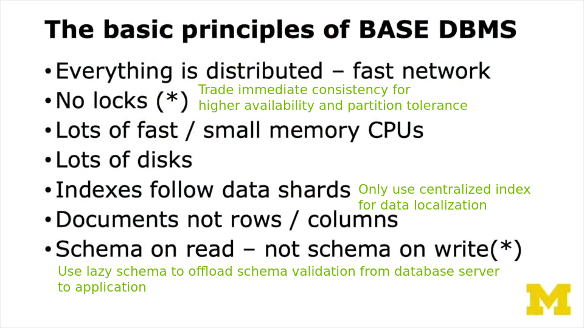

# Database Architecture

---

## Recap: Normalization in Relational Database


---

## ACID vs BASE

Modern single ACID instance can handle up to 1/4 million of requests.


---

### ACID

ACID is a set of four fundamental properties that guarantee reliable database transactions. Let's look into each property with concrete examples:

#### **A - Atomicity**

**"All or Nothing"** - A transaction either completes entirely or fails entirely, with no partial execution.

**Example**: Bank transfer of $100 from Account A to Account B

```sql
BEGIN TRANSACTION;
UPDATE accounts SET balance = balance - 100 WHERE account_id = 'A';
UPDATE accounts SET balance = balance + 100 WHERE account_id = 'B';
COMMIT;
```

If the system crashes after the first UPDATE but before the second, atomicity ensures that both operations are rolled back. You can't have money disappear from Account A without appearing in Account B.

#### **C - Consistency**

**"Valid State to Valid State"** - The database moves from one valid state to another, maintaining all defined rules and constraints.

**Example**: Inventory management system

```sql
-- Rule: stock_quantity cannot be negative
UPDATE products SET stock_quantity = stock_quantity - 5 WHERE product_id = 123;
```

If this would make `stock_quantity` negative, consistency prevents the transaction from completing, maintaining the business rule that you can't sell what you don't have.

#### **I - Isolation**

**"Concurrent Transactions Don't Interfere"** - Multiple transactions running simultaneously appear to execute sequentially.

**Example**: Two customers buying the last concert ticket

- Customer 1 checks: "1 ticket available" → tries to buy
- Customer 2 checks: "1 ticket available" → tries to buy
- Isolation ensures only one succeeds, preventing overselling

#### **D - Durability**

**"Permanent Once Committed"** - Once a transaction is committed, it survives system failures.

**Example**: Online order confirmation

```sql
INSERT INTO orders (customer_id, total, status) VALUES (456, 99.99, 'confirmed');
COMMIT;
```

After you see "Order Confirmed" on your screen, durability guarantees that even if the server crashes immediately after, your order is permanently recorded and won't be lost.

#### **Real-World Scenario**

Consider an e-commerce checkout process:
- **Atomicity**: Charge credit card AND reserve inventory AND create order record - all succeed or all fail
- **Consistency**: Inventory count remains accurate, account balances are correct
- **Isolation**: Multiple customers can checkout simultaneously without data corruption
- **Durability**: Your order confirmation email means the order is permanently saved

ACID properties are why traditional relational databases like PostgreSQL are trusted for financial systems, healthcare records, and other mission-critical applications where data integrity is paramount.

---

### BASE

BASE is an alternative approach to database design that prioritizes **availability and partition tolerance** over strict consistency. It's commonly used in distributed NoSQL systems. Let me explain each property with concrete examples:

#### **BA - Basically Available**

**"System Remains Operational"** - The database remains functional even when some nodes fail or network partitions occur.

**Example**: Social media feed (like Twitter/X)

```json
// User tries to post a tweet
POST /api/tweets
{
  "user_id": "12345",
  "content": "Hello world!",
  "timestamp": "2024-06-21T10:30:00Z"
}
```

Even if some servers are down, the system accepts your tweet and stores it on available nodes. Your tweet might not immediately appear to all users, but the system doesn't go completely offline.

#### **S - Soft State**

**"Data May Change Over Time"** - The system doesn't guarantee immediate consistency; data can be in flux as updates propagate.

**Example**: Shopping cart in distributed e-commerce system

- You add item to cart on West Coast server → stored locally
- Friend views your wishlist from East Coast server → might not see the new item yet
- After few seconds/minutes, the update propagates and becomes visible everywhere

The cart exists in a "soft state" during propagation - it's neither fully consistent nor inconsistent.

#### **E - Eventual Consistency**

**"All Nodes Will Eventually Agree"** - Given enough time without new updates, all replicas will converge to the same state.

**Example**: DNS (Domain Name System)

```bash
# You update your website's IP address
dig example.com
# Some DNS servers return old IP: 192.168.1.100
# Others return new IP: 192.168.1.200
# After TTL expires (hours/days), all servers show: 192.168.1.200
```

#### **Real-World BASE Scenario: Facebook/Meta**

**User Profile Update:**

1. **Basically Available**: You change your profile picture
   - System accepts the change even if some data centers are offline
   - Core functionality (posting, messaging) remains available

2. **Soft State**: During propagation
   - Your friends in different regions might see different profile pictures
   - Some see old photo, others see new photo
   - System is in transitional state

3. **Eventual Consistency**: After propagation
   - Within minutes/hours, all users worldwide see your new profile picture
   - All replicas eventually converge to the same state

#### **Why Choose BASE?**

BASE systems excel when:

- **High Availability** is more important than immediate consistency
- **Scale** requires distributing data across many servers/regions  
- **Performance** benefits from avoiding coordination overhead
- **Temporary Inconsistencies** are acceptable to users

Examples: Social networks, content delivery, recommendation engines, analytics systems, and real-time messaging platforms.

The key insight: BASE trades **strong consistency** for **high availability and partition tolerance** - perfect for modern distributed applications where "good enough, fast, and always available" often beats "perfect but sometimes slow or unavailable."

---

### **ACID vs BASE Trade-offs**

---

#### Illustrated Write


---

#### **Practical Implementation Differences: ACID vs BASE**

The philosophical differences between ACID and BASE translate into very concrete implementation decisions that affect how you design, develop, and operate your database systems. The following comparison highlights the practical trade-offs you'll encounter when choosing between these approaches. Each row represents a fundamental design decision that cascades through your entire application architecture.


| **Design Aspect** | **ACID Approach** | **BASE Approach** | **Why This Difference Matters** |
|-------------------|-------------------|-------------------|----------------------------------|
| **ID Generation** | **SERIAL/AUTO_INCREMENT keys**<br/>Sequential: 1, 2, 3, 4... | **GUIDs/UUIDs**<br/>Random: `550e8400-e29b-41d4-a716-446655440000` | **ACID**: Central coordinator ensures no conflicts but creates bottleneck<br/>**BASE**: Each node generates unique IDs independently, enabling true distributed writes |
| **Data Integrity** | **Database-enforced UNIQUE constraints**<br/>Violation = immediate rejection | **Application-level post-processing**<br/>Duplicates detected and resolved after insertion | **ACID**: "Prevention is better than cure" - stops problems before they happen<br/>**BASE**: "Ask forgiveness, not permission" - handles conflicts when discovered |
| **Write Operations** | **Immediate consistency via transactions**<br/>All nodes see changes instantly | **Eventual consistency with propagation delays**<br/>Changes spread across nodes over time | **ACID**: Slower writes but guaranteed correctness<br/>**BASE**: Faster writes but temporary inconsistencies during propagation |
| **Read Operations** | **Single source of truth**<br/>Same query always returns identical results | **Conflict resolution required**<br/>Different replicas may return different answers | **ACID**: Simple application logic - trust the database result<br/>**BASE**: Complex application logic - must handle conflicting data from replicas |

These design decisions are deeply interconnected:

### **ID Design → Write Performance**
- **ACID systems** use sequential IDs because they have a single point of coordination anyway
- **BASE systems** need GUIDs because distributed nodes can't coordinate for sequential numbering without sacrificing availability

### **Constraint Enforcement → Application Complexity**
- **ACID systems** push complexity into the database (foreign keys, triggers, constraints)
- **BASE systems** push complexity into the application code (validation, conflict resolution, reconciliation)

### **Consistency Model → Operational Overhead**
- **ACID systems** require careful transaction design but simpler monitoring
- **BASE systems** require sophisticated monitoring to detect and resolve data conflicts

---

#### Developer Guide

| Scenario | ACID (PostgreSQL) | BASE (Cassandra/MongoDB) |
|----------|------------------|---------------------------|
| **Bank Transfer** | ✅ Perfect - needs immediate consistency | ❌ Risky - temporary inconsistency unacceptable |
| **Social Media** | ❌ Overkill - delays for strict consistency | ✅ Perfect - availability more important |
| **Product Catalog** | ❌ Slow at scale | ✅ Fast, slight delays acceptable |

---

## Scaling Database

Compared with BASE databases, ACID databases are difficult to scale.

### Option 1 - Master Slave Replication


### Option 2 - Master Master Replication


### Option 3 - Polyglot Persistence


### Exercise

---

#### Question 1

The topic for this week is to compare, contrast, and explore the interplay between ACID and BASE style architectures. 

In this mini-paper (3-5 paragraphs) explain your take or views on these competing approaches to database architecture. 

Feel free to bring prior experience that you might have into the conversation.

#### Answer 1 by Claude Sonnet 4

The fundamental tension between ACID and BASE database architectures reflects a classic engineering trade-off: strong consistency versus high availability and scalability. After working with both approaches in production systems, I've learned that the choice isn't binary - it's about matching architectural properties to specific business requirements and user expectations.

ACID databases excel in scenarios where data integrity is non-negotiable. The atomicity, consistency, isolation, and durability properties make them indispensable for financial transactions, healthcare records, and inventory management systems where even temporary inconsistencies can have serious consequences. When a bank transfer must guarantee that money doesn't disappear or duplicate during processing, ACID's "all-or-nothing" approach provides the reliability that regulatory compliance and customer trust demand. However, this reliability comes at the cost of scalability - ACID systems struggle to handle massive concurrent loads without expensive vertical scaling or complex distributed coordination.

BASE systems (Basically Available, Soft state, Eventual consistency) prioritize availability and partition tolerance over immediate consistency, making them ideal for applications where user experience trumps perfect data synchronization. Social media feeds, content recommendation engines, and search indexes can tolerate temporary inconsistencies because users generally accept that new content might take moments to propagate globally. The ability to remain operational during network partitions or server failures often provides more business value than ensuring every user sees identical data at every millisecond.

The most pragmatic approach combines both philosophies through strategic architectural decisions. Modern applications increasingly adopt polyglot persistence, using ACID databases for core transactional data while leveraging BASE systems for analytics, caching, and content distribution. Even within traditional ACID systems, techniques like read replicas and eventual consistency for non-critical operations demonstrate how BASE principles can enhance scalability without compromising essential data integrity. The key insight is recognizing that different parts of the same application may have different consistency requirements, allowing architects to optimize each component for its specific role in delivering business value.
---

#### Question 2

Your organization is reaching the limits of its relational database application as it scales and you are in meeting to decide to move to a multi-master approach or not. 

Expanding the size of the single-master instance is quite expensive and requires a long-term contract. The multi-master approach is much less expensive and can use commodity hardware. 

Take a position for or against the switch to multi-master proposal. Write 3-5 paragraphs and share your reasoning on the position you have taken.

#### Answer 2 by Claude Sonnet 4

```markdown
### **Phase 1: Comprehensive Workload Analysis**

Before any architectural change, measure:

- Read/write ratio and peak load patterns
- Transaction complexity and cross-table dependencies  
- Geographic distribution of users and regulatory requirements
- Current failure points and recovery time objectives (RTO)

### **Phase 2: Alternative Solutions Before Multi-Master**

1. **Connection Pooling & Query Optimization**: Often 2-3x performance gains
2. **Read Replicas with Smart Routing**: Handle read scaling first
3. **Vertical Scaling with Reserved Instances**: Compare true TCO vs. multi-master complexity
4. **Caching Layer**: Redis/Memcached can dramatically reduce database load

### **Phase 3: Multi-Master Decision Framework**

Only proceed to multi-master if:

- Write throughput exceeds single-master capacity after optimization
- Geographic distribution requires regional write access
- Team has proven expertise in distributed systems
- Business can tolerate eventual consistency trade-offs

### **Implementation Risk Mitigation**

If multi-master is chosen:

- Implement comprehensive conflict detection and resolution
- Design application for eventual consistency from day one  
- Establish robust monitoring for replication lag and conflicts
- Plan for gradual rollout with rollback capabilities
```

---

## Cloud Architecture

### GMail


### Google Search


### Google UX


### Amazon Web Service


### Facebook


---

## The Emergence of BASE Model

The BASE model for databases emerged as a response to the limitations of ACID (Atomicity, Consistency, Isolation, Durability) databases, particularly in the context of distributed systems and the need for high availability and scalability.



### NoSQL Database Catalog


### The New Web Application Paradigm


### ACID + BASE


### The Polyglot Persistence


### BASE Dev in ACID Database


### Wrap-Up


Use well-established ACID database in a BASE way is the best approach to BASE database because

- The well established database has already been scaled to production grade

- BASE can be achieved through refraining from using those ACID operations