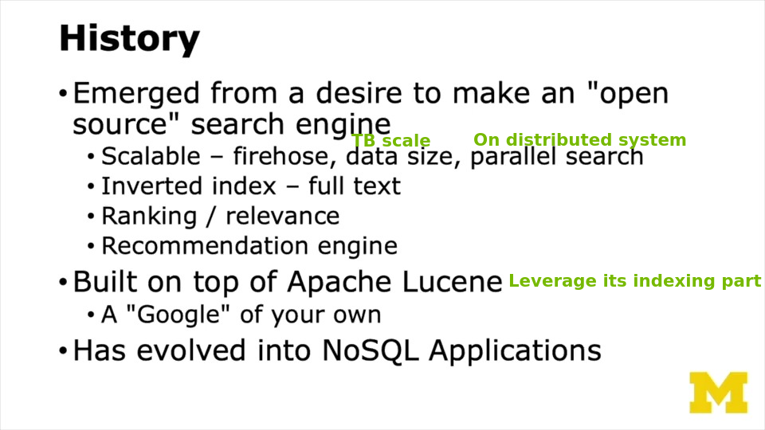
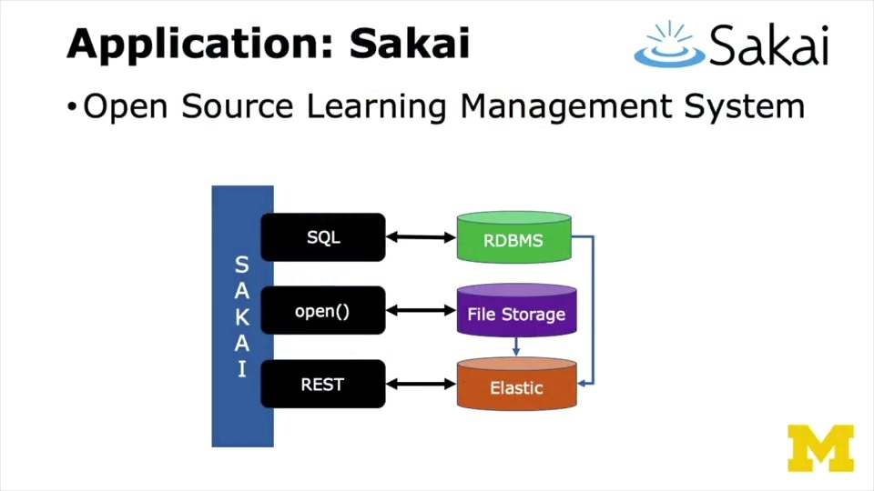
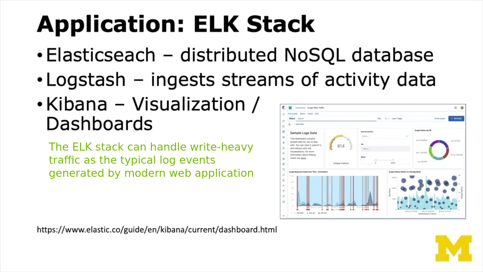

# Elastic Search

---

## Overview

---

## The Programming Interface

You can do everything in Elasticsearch through REST APIs. In Python we can use the high-level package `elasticsearch`

See [here](references/elasticsearch/workspace/README.md) for the hands-on introduction to Python Elasticsearch connector.